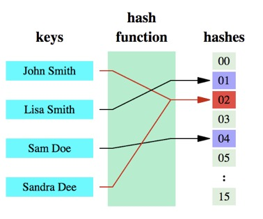
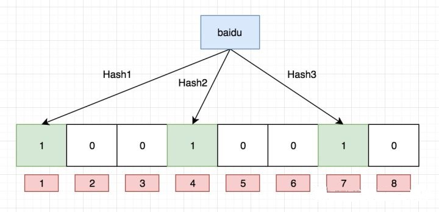
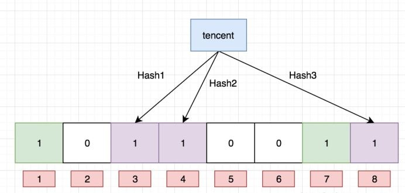
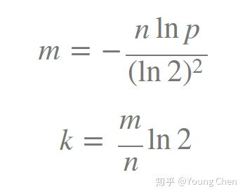
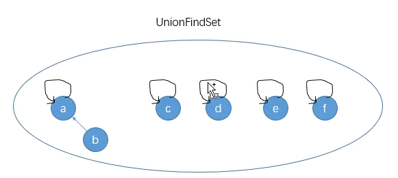

# AlgorithmEasyDay05

[TOC]


## 一、哈希函数

哈希函数的概念是：将任意大小的数据转换成特定大小的数据的函数，转换后的数据称为哈希值或哈希编码。下面是一幅示意图：



可以明显的看到，原始数据经过哈希函数的映射后成为了一个个的哈希编码，数据得到压缩。哈希函数是实现哈希表和布隆过滤器的基础。
### （一）哈希函数

- 哈希函数的特征
	- 输入域是无穷大的，输出域是有穷的；
	- 确定的输入值对应确定的输出值，即相同的输入值多次经过同一个哈希函数结果相同；
	- 不同的输入可能对应相同的输出（哈希碰撞）；因为无限大的输入域通过哈希函数映射到有限大的输出 S 域，必然存在多个输入映射到一个输出；
	- 哈希函数的离散型：对于一定量的输入，对应的输出值在 S 域是均匀分布的；
	如输入是 0 ~ 99（当然输入是无限的，这里只是示例），对应输出域为 0，1，2。则对应出现三个值的次数是**大致** 相同的。
	- 输入值是有规律的，不代表输出值是有规律的；
如输入：a1,a2,a3...但是对应的输出值可能差距很大；

**特征推广**
 如果输出值在 S 域上是均匀分布的，则 S 域上所有值 `%m` 在 `0  ~  m-1`上为均匀分布；

**哈希码**
输入值经过哈希函数之后得到哈希码，哈希码上每一位都是（`0~9，a~f`）之间的某个值，并且该值在这个范围内均匀分布，同时**哈希码的每一位之间都是相互独立的**。


### （二）实现一千个相互独立的哈希函数
- 方案一：使用一个哈希函数分开作为两个种子
因为哈希值为 N 个 16 位数的一串值，可以将 16 位数分为前 8 和后 8 位，分别作为 h1 和 h2 种子，即得到两个不相关的哈希函数（前后两部分相互独立），然后得到其他剩余的哈希函数： h3  = h1 + 1 * h2， h4 = h1 + 2 * h2，。。。。
- 方案二：使用两个哈希函数作为两个种子
即使用两个哈希函数作为种子，然后不断使用上面的公式得到其他的哈希函数。

### （三）对于一个 10 T 大小的文件，每行均为无序的字符串，打印里面所有重复的字符串
**解释**：首先文件中每行数据之间是无序的，然后重复的规则可能是多种。
**条件**：允许 1000 台机器（编号为 0 ~ 999），文件存放在分布式系统上；
**过程**：将每行读出来，然后计算每行字符串的哈希值，然后将该值 % 1000（结果值为 0 ~ 999 之一），对应的将这条字符串放入计算出来的编号位置上。所以如果字符串相同，则其哈希值相同，最终会落在同一个机器上。
虽然不同的字符串得到的哈希值可能相同，但是现在将所有的数据分布在 1000 台机器上进行独立处理。


## 二、哈希表
### （一）经典的哈希表结构
经典的哈希表是使用**数组 + 链表** 结构实现的，常用的方法有：`put(key,value)`， `get(key)`， `remove(key)`如图所示：

首先会分配一个数组空间（这里示例长度为 17），然后使用 `put(key1,value1)`时候，首先计算 key1 的哈希值得到 Code1，然后将 Code1 % 17（得到 0 ~ 16 之间一个值），然后将这对 key-vlaue 值挂在计算得到的值对应的位置后面（例如计算得到 5，就把该键值对挂载到下标为 5 的数组后面），其他所有的键值对都使用类似的方法。因为不同或者相同的 key 计算可能得到相同的哈希值，从而 % 17 的时候得到相同的数组下标，所以挂载之前看看该位置上是否已挂载其它键值对，如果有，则比较挂载的 key 值有无和当前的 key 值相同的，如果相同则将原来键值对的 value 值修改为当前键值对的 value 值，如果两个 key 值不相同则直接将该键值对挂载在原来链表后面即可。

- 根据哈希函数的性质，**每个位置后面挂载的链表数目应该是大致相同的**，即大致各位置后链表数目增长速度相同。

### （二）哈希表扩容
==哈希表有很多优化方式，因此默认增删改查操作的时间复杂度为 O（1）==

- 扩容方式
	- 在线扩容：用户线程需要暂停
    即原来数组长度为 17，数据量过大的时候后面挂载的链表数目就会很多，会影响操作效率，这里假设当后面链表节点数超过 5 即需要扩容至 104。扩容时候需要将原有哈希值重新经历哈希函数然后放置到新的数组对应位置上。
	- 离线扩容：扩容和用户操作同步进行
	当后面节点数到 5 的时候启动离线扩容（当前结构仍然可以使用，仅仅是效率有点下降），这时候在后台同时创建一个长度为 104 的数组，当用户使用 get 方法获取值时从原来结构中获取，当使用 put 方法放入值得时候，该键值对同时放入原来结构和扩容后的结构，扩容完成之后只需要将用户的指向该为扩容之后的结构即可。


```java
package nowcoder.easy.day05;  
  
import java.util.ArrayList;  
import java.util.HashMap;  
import java.util.List;  
import java.util.Map.Entry;  
  
/**  
 * @author GJXAIOU  
 * HashMap 基本使用操作 
 */
 public class HashMapOperation {  
  
    public static void main(String[] args) {  
        HashMap<String, String> map = new HashMap<>();  
        map.put("zhangsan", "11");  
  
        System.out.println(map.containsKey("zhangsan"));  
        System.out.println(map.containsKey("lisi"));  
        System.out.println("=========================");  
  
        System.out.println(map.get("zhangsan"));  
        System.out.println(map.get("lisi"));  
        System.out.println("=========================");  
  
        System.out.println(map.isEmpty());  
        System.out.println(map.size());  
        System.out.println("=========================");  
        // remove 方法返回删除 key 对应的 value 值  
  System.out.println(map.remove("zhangsan"));  
        System.out.println(map.containsKey("zhangsan"));  
        System.out.println(map.get("zhangsan"));  
        System.out.println(map.isEmpty());  
        System.out.println(map.size());  
        System.out.println("=========================");  
  
        map.put("zhangsan", "11");  
        System.out.println(map.get("zhangsan"));  
        map.put("zhangsan", "22");  
        System.out.println(map.get("zhangsan"));  
        System.out.println("=========================");  
  
        map.put("zhangsan", "11");  
        map.put("lisi", "22");  
        map.put("wangwu", "33");  
  
        for (String key : map.keySet()) {  
            System.out.println(key);  
        }  
        System.out.println("=========以上为 key 列表================");  
  
        for (String values : map.values()) {  
            System.out.println(values);  
        }  
        System.out.println("===========以上为 value 列表==============");  
  
        map.clear();  
        map.put("A", "1");  
        map.put("B", "2");  
        map.put("C", "3");  
        map.put("D", "1");  
        map.put("E", "2");  
        map.put("F", "3");  
        map.put("G", "1");  
        map.put("H", "2");  
        map.put("I", "3");  
        for (Entry<String, String> entry : map.entrySet()) {  
            String key = entry.getKey();  
            String value = entry.getValue();  
            System.out.println(key + "," + value);  
        }  
        System.out.println("=========================");  
  
        List<String> removeKeys = new ArrayList<String>();  
        for (Entry<String, String> entry : map.entrySet()) {  
            if (!entry.getValue().equals("1")) {  
                removeKeys.add(entry.getKey());  
            }  
        }  
        for (String removeKey : removeKeys) {  
            map.remove(removeKey);  
        }  
        for (Entry<String, String> entry : map.entrySet()) {  
            String key = entry.getKey();  
            String value = entry.getValue();  
            System.out.println(key + "," + value);  
        }  
        System.out.println("=========================");  
    }  
}
```
输出结果为：
```java
true
false
=========================
11
null
=========================
false
1
=========================
11
false
null
true
0
=========================
11
22
=========================
lisi
zhangsan
wangwu
=========以上为 key 列表================
22
11
33
===========以上为 value 列表==============
A,1
B,2
C,3
D,1
E,2
F,3
G,1
H,2
I,3
=========================
A,1
D,1
G,1
=========================
```


### （三）设计 RandomPool 结构

【题目】 设计一种结构，在该结构中有如下三个功能：
- insert(key)：将某个 key 加入到该结构，做到不重复加入。
- delete(key)：将原本在结构中的某个 key 移除。 
- getRandom()：等概率随机返回结构中的任何一个 key。

【要求】 Insert、delete 和 getRandom 方法的时间复杂度都是 O(1)

**思路**：因为如果使用一个哈希表则绝对不能保证 getRandom 方法中的严格等概率，因为输入值经过哈希函数之后的输出值仅仅是大致等概率均匀分布（均匀性只是在大样本情况下的近似均匀），因此需要使用两个哈希表；
两个哈希表结构为：


针对 put 方法，针对第一个键值对（str0, 0），数据放入哈希表之后（具体的存放位置不一定是图示的位置（因为经过哈希计算之后是离散的），正因为离散型，所以实际上放置的位置无关紧要，这里仅仅表示该哈希表有这个键值对即可，同时在另一个哈希表中存入对应的键值对（0，str0），每存入一个值 size 值 + 1。
**如果不考虑 remove 方法**，则使用下面代码即可保证 getRandom 方法等概率返回结构中任意一个 key。

```java
package nowcoder.easy.day05;  
  
/**  
 * 不考虑 Remove 方法的 RandomPool 程序 
 * @author GJXIAOU  
 * @create 2020/1/14 0014 上午 11:13  
 */  
import java.util.HashMap;  
  
public class RandomPoolWithoutRemove {  
    public HashMap<String, Integer> map1;  
    public HashMap<Integer, String> map2;  
    public int size;  
  
    public RandomPoolWithoutRemove() {  
        map1 = new HashMap<>();  
        map2 = new HashMap<>();  
        size = 0;  
    }  
  
    public void add(String str) {  
	    map1.put(str, size);  
	    map2.put(size, str);  
	    size++;  
    }
  
    public String getRandom() {  
        if (size == 0) {  
            return null;  
        }  
        int index = (int) (Math.random() * size);  
        return map2.get(index);  
    }  
}
```
**考虑到 remove 方法**：因为使用 remove 方法，会在整个数组中形成空位置，所以如果使用 getRandom 方法可能会获取到空位置，当空位置很多时候就得不断的进行重新计算新的非空位置使得时间复杂度不是 O(1)。
默认删除方式：例如这里删除 key 为 str17 的记录，则首先在哈希表 1 中找到 key 为 str17，删除该键值对，同时根据其对应的 value 值作为 key  值查询哈希表 2 中对应的键值对，然后删除该记录。 
**为了保证 getRandom 查询严格等概率并且时间复杂度为 O（1）**： **每次 Remove 之后使用哈希表中最后一个元素填充产生的洞**。
在删除哈希表中 str17 之前，将表中最后一个位置的 str999 放到 str17 位置，然后同样将哈希表 1 中该 key 对应的 value 对应的哈希表 2 中的 key = 17 的 value 值也设置为最后一个值 str999，然后删除两张表中的最后一条记录，同时将哈希表的长度 size 改为 999。
最后使用 Math.Random() * size 获取 0 ~ 998 之间的随机值，最后返回哈希表 2 中对应值的 value 值即可。
```java
package nowcoder.easy.day05;  
  
import java.util.HashMap;  
  
/**  
 * 完整的 RandomPool 结构 * * @author GJXAIOU  
 */public class RandomPool {  
  
    public static class Pool<K> {  
        private HashMap<K, Integer> keyIndexMap;  
        private HashMap<Integer, K> indexKeyMap;  
        private int size;  
  
        public Pool() {  
            this.keyIndexMap = new HashMap<K, Integer>();  
            this.indexKeyMap = new HashMap<Integer, K>();  
            this.size = 0;  
        }  
  
        public void insert(K key) {  
            if (!keyIndexMap.containsKey(key)) {  
                keyIndexMap.put(key, size);  
                indexKeyMap.put(size++, key);  
            }  
        }  
  
        public void delete(K key) {  
            if (keyIndexMap.containsKey(key)) {  
                int deleteIndex = keyIndexMap.get(key);  
                // 因为 index 从 0 开始，所以 lastIndex = --size  
  int lastIndex = --size;  
                // 将最后一个值放置到刚才删除的 deleteIndex 上面，然后删除 lastIndex。  
  K lastKey = indexKeyMap.get(lastIndex);  
                keyIndexMap.put(lastKey, deleteIndex);  
                indexKeyMap.put(deleteIndex, lastKey);  
                keyIndexMap.remove(key);  
                indexKeyMap.remove(lastIndex);  
            }  
        }  
  
        public K getRandom() {  
            if (this.size == 0) {  
                return null;  
            }  
            int randomIndex = (int) (Math.random() * this.size); // 0 ~ size -1  
  return indexKeyMap.get(randomIndex);  
        }  
    }  
  
    public static void main(String[] args) {  
        Pool<String> pool = new Pool<String>();  
        pool.insert("zhangsan");  
        pool.insert("lisi");  
        pool.insert("wangwu");  
        System.out.println(pool.getRandom());  
        System.out.println(pool.getRandom());  
        System.out.println(pool.getRandom());  
        System.out.println(pool.getRandom());  
        System.out.println(pool.getRandom());  
        System.out.println(pool.getRandom());  
    }  
}
```
程序运行结果：每次运行结果都是不一样的。
```java
zhangsan
wangwu
wangwu
wangwu
zhangsan
lisi
```

## 三、布隆过滤器
### （一）作用
- 一般用于判断某个值是否在集合中，如果在则一定返回 true，但是不在也可能返回 true，**有失误率**。即判断==某样东西一定不存在或者可能存在==。
- 相比于传统的 List、Set、Map 等数据结构，它更高效、占用空间更少，但是缺点是其返回的结果是概率性的，而不是确切的；
- 判断某个元素是否存在可以使用 HashMap，时间复杂度为 O（1），但是存储容量占比高（占用内存高），同时对于本地输入，数据在远程服务器，同时数据集大到无法一次性读进内存构建 HashMap 时候也存在问题。
- 比较针对黑名单问题和爬虫去重问题；

### （二）示例
**问题**： 判断 100 亿条占 64 字节的 URL，是否为一个 URL 黑名单集合中元素，在则返回 true，反之返回 false；

**解答**：
- 方案一：使用 HashSet，但是至少需要使用 6400 亿个字节长度（不包括指针等等占用位置），约为 640 G空间。
- 方案二：使用上述提到的哈希分流。
- 方案三：使用布隆过滤器
布隆过滤器是一个数组，每个元素为一个 bit。


**实现布隆过滤器代码**：
```java
package nowcoder.easy.day05;

/**
 * 使用基本数据结构实现布隆过滤器，如果想减少数组空间，可以使用 Long 类型或者使用矩阵
 * @author GJXIAOU
 * @create 2020/1/14 0014 下午 1:43
 */

public class BloomFilter {
    public static void main(String[] args) {
        // 使用 int 类型，因为一个 int 占 4 位即 32 bit，因此 1000 个 int 数据可以表示 32000bit；
        int[] arr = new int[1000];
        // 想要查询的 30000 位置对应哪一个下标；即将第 30000 位置描黑。
        int index = 30000;
        // 结果对应于上面数组中的 0 ~ 999 中间一个位置（桶）； intIndex = 937
        int intIndex = index / 32;
        // 对应于桶中的具体哪一个 bit 应该被描黑；bitIndex = 16
        int bitIndex = index % 32;
        // 1 << 16,即只有第 16 位为 1，其他均为0，同时 num | (1 << 16) 使得 num 的第 16 号位置变为 1，
        arr[intIndex] = (arr[intIndex] | (1 << bitIndex));
    }
}
```
**实现过程**
取其中一个 URL 分别经过 K 个相互独立的哈希函数（hash1，hash2，hash3，。。。hashk），分别得到哈希值 code1，code2，code3，。。。codeK，然后对所有的哈希值 %m，得到 0 ~ m - 1 之间的某个值，将这个值的位置描黑（如果该位置已经描黑，则继续描黑）。将所有的 URL 都按照此步骤走一遍，如果某个 URL 对应的 K 个数组中位置都是描黑的，则该 URL 在黑名单中，如果有一个不为黑则不在 URL 中。

### （三）布隆过滤器添加元素

-   将要添加的元素给 k 个哈希函数
-   得到对应于位数组上的 k 个位置
-   将这 k 个位置设为 1

### （四）布隆过滤器查询元素

-   将要查询的元素给 k 个哈希函数
-   得到对应于位数组上的 k 个位置
-   如果 k 个位置有一个为 0，则肯定不在集合中
-   如果 k 个位置全部为 1，则可能在集合中

**示例**：
布隆过滤器是一个 bit 向量或者说 bit 数组，长这样：


如果我们要映射一个值到布隆过滤器中，我们需要使用**多个不同的哈希函数**生成**多个哈希值，**并对每个生成的哈希值指向的 bit 位置 1，例如针对值 “baidu” 和三个不同的哈希函数分别生成了哈希值 1、4、7，则上图转变为：



Ok，我们现在再存一个值 “tencent”，如果哈希函数返回 3、4、8 的话，图继续变为：



值得注意的是，4 这个 bit 位由于两个值的哈希函数都返回了这个 bit 位，因此它被覆盖了。现在我们如果想查询 “dianping” 这个值是否存在，哈希函数返回了 1、5、8三个值，结果我们发现 5 这个 bit 位上的值为 0，**说明没有任何一个值映射到这个 bit 位上**，因此我们可以很确定地说 “dianping” 这个值不存在。而当我们需要查询 “baidu” 这个值是否存在的话，那么哈希函数必然会返回 1、4、7，然后我们检查发现这三个 bit 位上的值均为 1，那么我们可以说 “baidu”  **存在了么？答案是不可以，只能是 “baidu” 这个值可能存在。**

这是为什么呢？答案跟简单，因为随着增加的值越来越多，被置为 1 的 bit 位也会越来越多，这样某个值 “taobao” 即使没有被存储过，但是万一哈希函数返回的三个 bit 位都被其他值置位了 1 ，那么程序还是会判断 “taobao” 这个值存在。

### （五）不支持删除

不支持 delete 操作，只支持 add 和 isExit 操作，例如上图中的 bit 位 4 被两个值共同覆盖的话，一旦你删除其中一个值例如 “tencent” 而将其置位 0，那么下次判断另一个值例如 “baidu” 是否存在的话，会直接返回 false，而实际上你并没有删除它。

如何解决这个问题，答案是计数删除。但是计数删除需要存储一个数值，而不是原先的 bit 位，会增大占用的内存大小。这样的话，增加一个值就是将对应索引槽上存储的值加一，删除则是减一，判断是否存在则是看值是否大于0。

### （六）如何选择哈希函数个数和布隆过滤器长度

很显然，过小的布隆过滤器很快所有的 bit 位均为 1，那么查询任何值都会返回“可能存在”，起不到过滤的目的了。布隆过滤器的长度会直接影响误报率，布隆过滤器越长其误报率越小。

另外，哈希函数的个数也需要权衡，个数越多则布隆过滤器 bit 位置位 1 的速度越快，且布隆过滤器的效率越低；但是如果太少的话，那我们的误报率会变高。


k 为哈希函数个数，m 为布隆过滤器长度，n 为插入的元素个数，p 为误报率

如何选择适合业务的 k 和 m 值呢，这里直接贴一个公式：



如何推导这个公式这里只是提一句，因为对于使用来说并没有太大的意义，你让一个高中生来推会推得很快。k 次哈希函数某一 bit 位未被置为 1 的概率为：

![[公式]](AlgorithmEasyDay05.resource/equation-1577590954824.svg)

插入n个元素后依旧为 0 的概率和为 1 的概率分别是：

![[公式]](https://www.zhihu.com/equation?tex=%5Cleft%28+1-%5Cfrac%7B1%7D%7Bm%7D+%5Cright%29%5E%7Bnk%7D)  ![[公式]](AlgorithmEasyDay05.resource/equation.svg)

标明某个元素是否在集合中所需的 k 个位置都按照如上的方法设置为 1，但是该方法可能会使算法错误的认为某一原本不在集合中的元素却被检测为在该集合中（False Positives），该概率由以下公式确定

![[公式]](AlgorithmEasyDay05.resource/equation-1577590957471.svg)

## 四、最佳实践

常见的适用常见有，利用布隆过滤器减少磁盘 IO 或者网络请求，因为一旦一个值必定不存在的话，我们可以不用进行后续昂贵的查询请求。

另外，既然你使用布隆过滤器来加速查找和判断是否存在，那么性能很低的哈希函数不是个好选择，推荐 MurmurHash、Fnv 这些。

**大Value拆分**

Redis 因其支持 setbit 和 getbit 操作，且纯内存性能高等特点，因此天然就可以作为布隆过滤器来使用。但是布隆过滤器的不当使用极易产生大 Value，增加 Redis 阻塞风险，因此生成环境中建议对体积庞大的布隆过滤器进行拆分。

拆分的形式方法多种多样，但是本质是不要将 Hash(Key) 之后的请求分散在多个节点的多个小 bitmap 上，而是应该拆分成多个小 bitmap 之后，对一个 Key 的所有哈希函数都落在这一个小 bitmap 上。

**优化**
- 所需数组的长度和 URL 的数目有关，和需求的失误率有关，和每条 URL 的长度（所含字节数）无关；
- 数组长度计算公式：$$m = - \frac{n * (ln^p)}{(ln^2)^2}$$，其中 n表示样本量， p 为预期失误率；
此题中： n = 100亿，p = 0.0001，则 m = 131571428572 bit ≈ 16G。
- 需要哈希函数的个数：$$ K = In^{2} * \frac{m}{n} = 0.7 * \frac{m}{n}$$ ，这里约等于 13，如果计算的值为小数，需要进行向上取整；
- 真实失误率：$$ (1 - e^{-\frac{n * k}{m}})^k $$ ，这里计算的值约为：十万分之六，低于要求的失误率。


### （一）一致性哈希

哈希可以近似的实现负载均衡，但是一旦发生设备的增删则需要将所有的数据进行迁移，可以使用一致性哈希来降低迁移代价并且实现负载均衡。


#### 1.经典服务器抗压结构


比如后端共有三台存储服务器，需要将一系列键值对进行存储，首先将 key 经过哈希函数得到哈希值，然后将哈希值 % 存储器数目（图示为 3），这里得到 0 ~ 2 中间一个值，然后将对应的键值对存储到该存储器中即可。取值的时候同样上面步骤找到对应的存储器，然后在对应的存储器找那个查找数据。

**缺点**：当加机器或者减机器的时候就需要将所有存储的数据重新计算哈希值并且重新放置位置，即所有的数据都需要进行迁移。


#### （二）一致性哈希

假设哈希函数的范围为：0 ~ $$2^{64}$$ ，同样是三台存储设备，这里取三台机器的 IP 作为各自的识别码（只要可以唯一区别各自即可），将每台机器的 IP 经过哈希函数得到的哈希值对应于环上。


当放置键值对数据时候，首先将 key 经过哈希函数之后的哈希值（对应于环上一个位置），然后顺时针找到最近的机器，将该条记录放置到该机器上面。查找的时候同样。


**结构实现**

首先分别计算 m1, m2, m3 的哈希值，得到他们之间从小到大的一个数组排列，例如 [m1, m3, m2]，然后放置数据时候，将需存入的数据的 key 值经过哈希函数得到哈希值，然后将该哈希值在上面的数组排列中使用二分查找的方法得到第一个刚刚大于等于该哈希值的位置。即将记录存入该机器。

**增加/删除时候的数据迁移**

示例：增加机器 m4,通过计算其哈希值得到其位于 m2 到 m3 之间，则只需要将 m2 到 m4 之间的数据进行数据迁移，重新计算其哈希值然后将其从 m3 迁移到 m4 即可。

**问题**

当如图所示中机器较少的情况下，环很难得到等分，以及添加机器之后同样会发送环不等分造成无法实现负载均衡。

使用虚拟节点技术：为每个真实机器分配很多虚拟结点，然后让虚拟结点去占环上的位置；

示例： 真实机器 m -1：对应的虚拟结点 m-1-1, m-1-2……..m-1-1000;

真实机器 m -2：对应的虚拟结点 m-2-1, m-2-2……..m-2-1000;

真实机器 m -3：对应的虚拟结点 m-3-1, m-3-2……..m-3-1000;

真实机器和虚拟节点之间通过路由表来实现映射，实现真实机器知道自己有哪些虚拟节点，同样每个虚拟结点都可以通过路由表找到归属的物理机，通过上述范围方法得到的由虚拟节点负责的数据交给对应的物理机来处理。


## 五、并查集结构
**并查集**是一种树型的数据结构，用于处理一些不交集（Disjoint Sets）的合并及查询问题。有一个**联合-查找算法**（**union-find algorithm**）定义了两个用于此数据结构的操作：

-   Find：确定元素属于哪一个子集。它可以被用来确定两个元素是否属于同一子集。
-   Union：将两个子集合并成同一个集合。

首先并查集本身是一个结构，我们在构造它的时候需要将所有要操作的数据扔进去，初始时每个数据自成一个结点，且每个结点都有一个父指针（初始时指向自己）。

**前提**就是所有集合中的数据必须是一次性提前给定的，不能以流的方式动态的加入数据到集合中。

### （一）功能作用

- 查询两个元素是否属于同一个集合：isSameSet(A,B)，本质上是判断元素 A 和元素 B 所属的集合是否为同一个集合。
- 两个元素各自所在的**所有集合**进行合并：union(A,B)；

### （二）前提

所有集合中的数据必须是一次性提前给定的，不能以流的方式动态的加入数据到集合中。

### （三）实现步骤

- 首先给定数据集合，这里以 int 类型为例 {1,2,3,4,5}
- 初始时并查集中的每个结点都算是一个子集，我们可以对任意两个元素进行合并操作。值得注意的是，`union(nodeA,nodeB)`并不是将结点`nodeA`和`nodeB`合并成一个集合，而是将`nodeA`所在的集合和`nodeB`所在的集合合并成一个新的子集：


- 元素所属集合：
    集合（一般为多叉树结构）中元素一直向上查找，一直找到一个结点的上一个结点指向自己，则该结点称为代表节点（并查集初始化时，每个结点都是各自集合的代表结点），同时**该节点代表整个集合**。`find`操作：查找两个结点是否所属同一个集合。我们只需判断两个结点所在集合的代表结点是否是同一个就可以了：

- 集合合并：合并两个集合就是将结点个数较少的那个集合的代表结点的父指针指向另一个集合的代表结点。3，5 集合合并

        

- 查找优化：**查询到代表结点之后，将查询过程中经历的所有结点进行打平**。
    例如下面结构中查询节点 3 的代表节点，过程就是依次向上查询，一直遍历查询到 1，然后返回 1 并将沿途经过的结点2 打平（直接挂在代表结点下面）。

    


代码：

```java
package nowcoder.easy.day05;

import java.util.HashMap;
import java.util.List;

/**
 * 查找两个节点是否在同一个集合中
 * @author GJXAIOU
 */
public class UnionFind {

	public static class Node {
		// 可以是 String，Int，等等类型
	}

	// 初始化并查集中数据
	public static class UnionFindSet {
		// key:child,value:father节点
		public HashMap<Node, Node> fatherMap;
		// 某结点（使用代表结点即可）所在集合中有多少个结点
		public HashMap<Node, Integer> sizeMap;

		// 初始化的时候创建两个表，用户必须给定数据
		public UnionFindSet(List<Node> nodes) {
			makeSets(nodes);
		}

		private void makeSets(List<Node> nodes) {
			fatherMap = new HashMap<Node, Node>();
			sizeMap = new HashMap<Node, Integer>();
			for (Node node : nodes) {
				// 每个结点构成一个集合
				fatherMap.put(node, node);
				// 每个集合中都加上 size 为 1；
				sizeMap.put(node, 1);
			}
		}

		// 找头，并将其扁平化
		private Node findHead(Node node) {
			Node father = fatherMap.get(node);
			if (father != node) {
				father = findHead(father);
			}
			// 然后将 father 为头结点，将其挂在所有结点上。
			fatherMap.put(node, father);
			return father;
		}
		// 上面方法的非递归版本
//		private Node findHead(Node node) {
//			Stack<Node> stack = new Stack<Node>();
//			Node cur = node;
//			Node parent = fatherMap.get(cur);
//			// 一直向上找，找到头结点，其余结点放在栈中
//			while (cur != parent){
//				stack.push(cur);
//				cur = parent;
//				parent = fatherMap.get(cur);
//			}
//			// 将栈中所有元素挨个弹出，并将它们的父结点设置为头结点。
//			while (! stack.isEmpty()){
//				fatherMap.put(stack.pop(), parent);
//			}
//			return  parent;
//		}

		public boolean isSameSet(Node a, Node b) {
			return findHead(a) == findHead(b);
		}

		public void union(Node a, Node b) {
			if (a == null || b == null) {
				return;
			}
			Node aHead = findHead(a);
			Node bHead = findHead(b);
			if (aHead != bHead) {
				int aSetSize= sizeMap.get(aHead);
				int bSetSize = sizeMap.get(bHead);
				if (aSetSize <= bSetSize) {
					fatherMap.put(aHead, bHead);
					sizeMap.put(bHead, aSetSize + bSetSize);
				} else {
					fatherMap.put(bHead, aHead);
					sizeMap.put(aHead, aSetSize + bSetSize);
				}
			}
		}
	}

	public static void main(String[] args) {

	}
}
```

### （四）岛问题：

【问题】一个矩阵中只有 0 和 1 两种值，每个位置都可以和自己的上、下、左、右四个位置相连接，如果有一片 1 连接在一起，则这个部分称为一个岛，求一个矩阵中有多少个岛。

【示例】下面矩阵中有三个岛。


【解答】如果只是单 CPU 的情况直接使用递归即可，代码如下：

```java
package nowcoder.easy.day05;

/**
 * 岛问题
 *
 * @author GJXAIOU
 */
public class Islands {

    public static int countIslands(int[][] inputArray) {
        if (inputArray == null || inputArray[0] == null) {
            return 0;
        }
        // row 为行数，column 为列数
        int row = inputArray.length;
        int column = inputArray[0].length;
        int res = 0;
        for (int i = 0; i < row; i++) {
            for (int j = 0; j < column; j++) {
                if (inputArray[i][j] == 1) {
                    // 岛的数目 + 1
                    res++;
                    // 进入感染函数，将其连成一片的 1 全部改为 2
                    infect(inputArray, i, j, row, column);
                }
            }
        }
        return res;
    }

    public static void infect(int[][] inputArray, int i, int j, int row, int column) {
        // 判断边界以及当前遍历到的结点值是否为 1；
        if (i < 0 || i >= row || j < 0 || j >= column || inputArray[i][j] != 1) {
            return;
        }
        inputArray[i][j] = 2;
        infect(inputArray, i + 1, j, row, column);
        infect(inputArray, i - 1, j, row, column);
        infect(inputArray, i, j + 1, row, column);
        infect(inputArray, i, j - 1, row, column);
    }

    public static void main(String[] args) {
        int[][] m1 = {{0, 0, 0, 0, 0, 0, 0, 0, 0},
                {0, 1, 1, 1, 0, 1, 1, 1, 0},
                {0, 1, 1, 1, 0, 0, 0, 1, 0},
                {0, 1, 1, 0, 0, 0, 0, 0, 0},
                {0, 0, 0, 0, 0, 1, 1, 0, 0},
                {0, 0, 0, 0, 1, 1, 1, 0, 0},
                {0, 0, 0, 0, 0, 0, 0, 0, 0},};
        System.out.println(countIslands(m1));

        int[][] m2 = {{0, 0, 0, 0, 0, 0, 0, 0, 0},
                {0, 1, 1, 1, 1, 1, 1, 1, 0},
                {0, 1, 1, 1, 0, 0, 0, 1, 0},
                {0, 1, 1, 0, 0, 0, 1, 1, 0},
                {0, 0, 0, 0, 0, 1, 1, 0, 0},
                {0, 0, 0, 0, 1, 1, 1, 0, 0},
                {0, 0, 0, 0, 0, 0, 0, 0, 0},};
        System.out.println(countIslands(m2));
    }
}

```


如果矩阵非常大，并且可以使用多个 CPU 进行多任务并行计算，可以使用分治思想来切分开矩阵分别计算每个小矩阵中岛的数量，然后进行合并。（**合并是难点**）

示例和步骤：


上面矩阵分割成两部分，每个部分岛的数量进行单独计算然后进行合并，在单独计算时候，以左边为例，首先是从左上角第一个元素开始判断，第一个位置为 1 ，其他位置的 1 均由该位置感染，因此该位置称为感染中心，记为 A，由该位置感染的所有其它位置元素的感染中心均为 A，其它岛的感染中心类似。

在合并阶段：分开求得岛的数量为 4 个，合并只是针对边界上的部分进行去重。

以第一行边界两个元素为例，他们所对应的感染中心分别为 A，B，并且 A， B 不在一个集合中（默认四个感染中心属于各自集合），则首先将岛的数量减一，然后将 A，B 放入一个集合中。

第二行：对应的感染中心为 A，B，但是 A ，B 在一个集合中，所有总的岛的数量不减一；

第三行没有边界不是两个一，无需考虑；

第四行：感染中心分别为 C，B，不在一个集合中，则岛的数量减一，然后将两个放入集合中，现在集合中有 A， B，C 。

第五行同样不需要判断。

最终结果：4 - 1 -1 = 2

