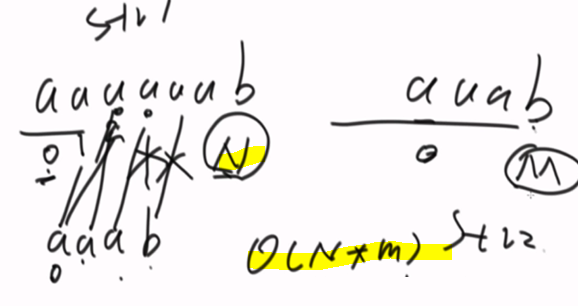
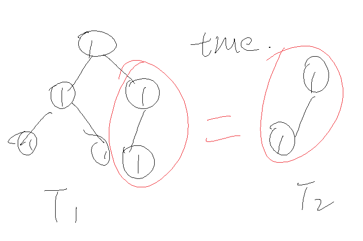
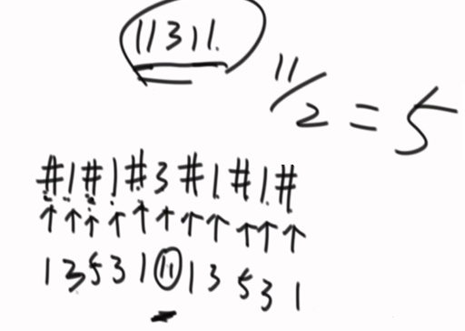
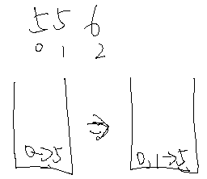

# AlgorithmMediumDay01


## 一、KMP

代码

```java
public static int getIndexOf(String s, String m){
    if(s == null || m == null || m.length() < 1 || s.length() < m.length()){
        return -1;
    }
    char[] ss = s.toCharArray();
    char[] ms = m.toCharArray();
    int si = 0;
    int mi = 0;
    int[] next = getNextArray(ms);
    while (si < ss.length && mi < ms.length){
        if (ss[si] == ms[mi]){
            si++;
            mi++;
            // 数组中值等于 -1 ，说明是第一个元素，说明当前 str1  中值连 str2 第一个字母都匹配不上，则直接从 str1 的下一个开始进行匹配
        } else if (next[mi] == -1){
            si++;
        } else {
            mi = next[mi];
        }
    }
    return mi == ms.length ? si - mi : -1;
}

// 求解 next 数组方法
public static int[] getNextArray(char[] ms){
    if (ms.length == 1){
        return new int[] { -1 };
    }
    int[] next = new int[ms.length];
    next[0] = -1;
    next[1] = 0;
    // 需要求值的位置
    int pos = 2;
    int cn = 0;
    while (pos < next.length){
        if (ms[pos - 1] == ms[cn]){
            next[pos++] = ++cn;
        } else if (cn > 0){
            cn = next[cn];
        } else {
            next[i++] = 0;
        }
    }
    return next;
}

```


# KMP算法：

给定两个字符串 str 和 match，长度分别为 N 和 M，实现一个算法，如果字符串 str 中含有子串 match，则返回 match 在 str 中的开始位置，不含有则返回 -1。

**举例**

str=”acbc”, match=”bc”，返回 2。

str=”acbc”, mathc=”bcc”, 返回 -1。

**要求**

如果 match 的长度大于 str 的长度（M > N），str 必然不会含有 match，则直接返回 -1，但是如果 N >= M，要求算法复杂度为 O(N)。


## 常规想法：

一个个匹配  时间复杂度太高



总结： 我们发现 每次匹配前面的并没有给后面一些指导信息

Note:  子串 和子序列不一样 前者是连续的 后者可以是不连续的  注意区分

**详细解释如下：**


## KMP算法思路:

**1 现根据match生成最大前后缀匹配长度数组 ：**


**2  从str[i]字符出发---匹配到j位置上发现开始出现不匹配：**


**3 下一次match 数组往右滑动， 滑动大小为match当前字符的最大前后缀匹配长度，再让str[j]与match[k]进行下一次匹配~**


**4 注意为什么加快，主要是str[i]--c前那段不用考虑，因为肯定不能匹配~**

**若有匹配 则出现更大的前后缀匹配长度 ，与最初nextArr[] 定义违背。**


**代码：** 


**关于nextArr数组的求解：**


**代码：**


#### 讨论计算复杂度：


## 相关题目：

#### 1 .（京东）给定一个字符串 如何加最短的字符（只能在原始串的后面进行添加）使其构成一个长的字符串且包含两个原始字符串，并且开始位置还得不一样

**思路：**其实就是最大前后缀长度数组~  e.g. abcabc ---->abcabcabc 最少增加3个


多求一位nextArr   可以看出之前4个复用 所以再添一位就好~

总结： 在KMP中nextArr数组基础上 多求一位终止位 将不是的补上即可

#### 2. 给定两个树（值可以相同或者不同） 判断数 1 的某棵子树是否包含树 2（结构和值完全相同），  是则返回true

子树就是从某个头结点开始下面所有子节点都要，下图第一个图就是可以 true，另一个图就是 false。




思路： 把一棵树序列化（可以先序、中序、后续）为字符串（字符数组）  。如果str2是str1的子串 则T2也是T1的子树。


#### 3 判断一个大字符串是否由一个小字符串重复得到~

就是某个字符串是否为某个小字符串 * n 得到；

转换为 一个前缀和后缀相差整数倍的问题


# Manacher算法：

**Manacher 算法详解与应用**

给定一个字符串 str，返回 str 中最长回文子串的长度。


常规思路： 

1  总是从中间那个字符出发--向两边开始扩展--观察回文，然后每个字符都得进行一遍

   但是奇数位数字完全可以  偶数位数字不可以，例如 1221 对应的每位扩充结果为：1 1 1 1 ，但是结果为 4.会出错

2   经过规律发现 无论是哪种情况 总是 最大值/2 即为最大回文串长度

   前提是 要处理字符串形式 加入特殊字符占位 #（其实什么字符都行）进行填充（在开头结尾和每个中间加入）

 这种方法是 暴力法 时间复杂度为$$O(n^2)$$-----而Manacher算法可以降到O(n)





**概念汇总**

回文直径：从某个值开始往两边扩充，能扩充的最长值；

回文半径：见图


回文半径数组：还是从头到最后挨个求每个位置的回文半径，然后存入一个数组中

最右回文半径：如图所示，刚开始默认在 -1 位置，然后当到 0 位置，回文半径只能到 0 位置，所以最右的回文半径为 0  位置，当到 1 位置时候，回文半径扩充到 2 位置，则最右回文半径扩充到 2 位置，当移动到 3 位置时候，最右回文半径为 6


最右回文半径的中心：上面最后一个取得最右边界时候中心为 3，后面 4,5,6 的最右边界可能也是该位置，但是仅仅记录第一个使得最右回文边界到的中心，即 3。


#### Manacher算法

针对 i 位置的回文串求法

- 如果 i 位置当前不在最右回文半径中，只能采用上面的方式暴力破：O(N )

    

- i 位置在回文右边界内：则设当前回文中心为 C，则 i 位置肯定是在回文中心 C 和回文右边界之间，做 i 位置关于中心 C 的对称点 i’，则针对 i’ 的所在的回文区域与整个回文区域关系有不同情况

    - i' 所在的回文区域在整个回文区域之间：O(1)

        

则 i 回文长度大小和 i’ 回文长度相同。证明：使用对称和区间内小回文，整个大区间大回文的结论可以证明 i 对应的区域是回文，并且是最大的。

- ​		i' 所在的回文区域在整个回文区域相交：O(1)

    

则 i 回文长度为 i 到 R 长度。

- i' 所在的回文区域与整个回文区域之间边界重叠

    

这种情况下，只能保证 i 到 R  区间的数据不需要进行暴力破，相当于可以从 R + 1 位置开始判断。


代码：

```java
package nowcoder.advanced.class01;

/**
 * @Author GJXAIOU
 * @Date 2020/1/1 14:22
 */
public class Manacher {
    public static char[] manacherString(String str) {
        char[] charArr = str.toCharArray();
        char[] res = new char[str.length() * 2 + 1];
        int index = 0;
        for (int i = 0; i != res.length; i++) {
            res[i] = (i & 1) == 0 ? '#' : charArr[index++];
        }
        return res;
    }

    public static int maxLcpsLength(String str) {
        if (str == null || str.length() == 0) {
            return 0;
        }
        char[] charArr = manacherString(str);
        // 回文半径数组
        int[] pArr = new int[charArr.length];
        // index  为对称中心 C
        int index = -1;
        int pR = -1;
        int max = Integer.MIN_VALUE;
        for (int i = 0; i != charArr.length; i++) {
            // 2 * index - 1 就是对应 i' 位置，R> i,表示 i 在回文右边界里面，则最起码有一个不用验的区域，
            pArr[i] = pR > i ? Math.min(pArr[2 * index - i], pR - i) : 1;
            // 四种情况都让扩一下，其中 1 和 4 会成功，但是 2 ，3 会失败则回文右边界不改变；可以自己写成 if-else 问题。
            while (i + pArr[i] < charArr.length && i - pArr[i] > -1) {
                if (charArr[i + pArr[i]] == charArr[i - pArr[i]]) {
                    pArr[i]++;
                } else {
                    break;
                }
            }
            if (i + pArr[i] > pR) {
                pR = i + pArr[i];
                index = i;
            }
            max = Math.max(max, pArr[i]);
        }
        return max - 1;
    }

    public static void main(String[] args) {
        int length = maxLcpsLength("123abccbadbccba4w2");
        System.out.println(length);
    }
}

```


用处：

一个字符串，只能向后面添加字符，怎么整个串都变成回文串，要求添加字符最短。

e.g. ‘abc12321’ 应添加 ‘cba’ 变成’abc12321cba‘

即求，在包含最后一个字符情况下，最长回文串多少，前面不是的部分，逆序添加即可。

用manacher求得回文边界，发现边界与字符串最后位置，停止，求得回文中心C与有边界R，找到回文字符串，用原字符串减去该部分，在逆序就是结果。

```java
package nowcoder.advanced.class01;

/**
 * @Author GJXAIOU
 * @Date 2020/1/1 14:11
 */
public class LastAddString {
    public static char[] manacherString(String str) {
        char[] charArr = str.toCharArray();
        char[] res = new char[str.length() * 2 + 1];
        int index = 0;
        for (int i = 0; i != res.length; i++) {
            res[i] = (i & 1) == 0 ? '#' : charArr[index++];
        }
        return res;
    }

    public static String shortestEnd(String str) {
        if (str == null || str.length() == 0) {
            return null;
        }
        char[] charArr = manacherString(str);
        int[] pArr = new int[charArr.length];
        int index = -1;
        int pR = -1;
        int maxContainsEnd = -1;
        for (int i = 0; i != charArr.length; i++) {
            pArr[i] = pR > i ? Math.min(pArr[2 * index - i], pR - i) : 1;
            while (i + pArr[i] < charArr.length && i - pArr[i] > -1) {
                if (charArr[i + pArr[i]] == charArr[i - pArr[i]]) {
                    pArr[i]++;
                } else {
                    break;
                }
            }
            if (i + pArr[i] > pR) {
                pR = i + pArr[i];
                index = i;
            }
            if (pR == charArr.length) {
                maxContainsEnd = pArr[i];
                break;
            }
        }
        char[] res = new char[str.length() - maxContainsEnd + 1];
        for (int i = 0; i < res.length; i++) {
            res[res.length - 1 - i] = charArr[i * 2 + 1];
        }
        return String.valueOf(res);
    }

    public static void main(String[] args) {
        String yuanlai = LastAddString.shortestEnd("abcd123321");
        System.out.println(yuanlai);
    }
}
```


# BFPRT算法： 

### BFPRT 算法详解与应用：

 **这个算法其实就是用来解决 ： 求解最小/最大的k个数问题：**（求第 K 小的数，实际得到数组中为第 k-1 位置数）

- 最暴力的方法是：遍历然后查找：$$O(N*log^N)$$

- 常规的做法 就是 平均时间复杂度为 O(n) 的 partition 函数的应用，划分结果为小于某个数的放左边，等于某个数的放中间，大于某个数的放右边，然后看等于的左右边界，例如第一次划分结果左右边界为：500 ~ 600 位，查找的是第 300 小的数，则将小于区域按照上面方式再次使用 partition 函数进行划分，如果等于区域命中就结束过程，依次类推。  
    - 缺点：是概率式的，无法避免最差的情况（因为每次选取的划分值是随机的，很难保证大于和小于该值的区间长度差不多）。因此最终期望为：$$O(N)$$

- BFPRT算法优点是确定性的，严格的 $$O(N)$$。


大概思路：

 将整个数组以5个数字一组划分 ,最后不满 5 个的单独成组，分别进行组内排序（组间不排序） ，因为只是 5 个数排序，所有时间复杂度为O(1)， 同时因为整个数组分为N/5组，所以则总共时间复杂度为O(N)。

3) 把每个组内的中位数拿出来构成一个新数组，若为偶数则拿其上中位数即可，数组长度为 N/5

4）递归调用该bfprt函数，传入刚才的中位数数组 和 中位数数组长度的一半 （继续求中位数）【BFPRT 函数格式为： int BFPRT（arr,k) 输入数组 arr 和要求的第 k 小的值】

5）将4）返回的值作为原始数组划分值，一直以该值作为 paritition 函数的划分值。


例子：


每一步的时间复杂度为：假设原始数据量为 N，则

- 步骤一：O(1)

- 步骤二：O(N)

- 步骤三：O(N)

- 步骤四：因为是递归：T（N/5），最终获取划分值 P

- 步骤五：在 partition 算法中如果不是值正好在相等区域的情况下，则不是在小于就是在大于区间上，同时两个区间后续只有一个需要再次判断，另一个区间直接舍弃。

    判断最差的情况：左侧最差情况，就是找到最多能有多少数是小于划分值 P（即）最少多少数的确定大于划分值 P 的，所以至少共 3N/10 大于划分值。所以左边比它小的最多有7N/10。右边类似。
    
    所以最终该步骤左右时间复杂度为：$$T(\frac{7N}{10})$$ ，因为只算一个，所以最终仍然是：$$T(\frac{7N}{10})$$ 。
    
    所以整体时间复杂度为：$$T(N) = T(\frac{N}{5}) + T(\frac{7N}{10}) + O(N)$$，结果为 O(N)，证明见算法导论。


优点 :我们选择的基准一定将数组划分为 一定规模的子部分


由上图我们可以看到： 最中间的中位数--- 右边比它大的**至少**有N/10 * 3 个（每个组又有两个大于该组中位数的数字）

​                                右边比它小的最多有N/10 * 7

​                             ---- 同理左边也是~

如下例子：  7为中位数 ----比它大的至少有 8 9 12 13 14 这几个数


重点掌握思路 可以面试的时候告诉面试官~~


**代码：** ==还是有问题==

```java
package nowcoder.advanced.class01;

import java.sql.SQLOutput;

/**
 * @Author GJXAIOU
 * @Date 2020/1/1 16:13
 */
public class BFPRT {
    // 使用堆的方式来求解该题，时间复杂度为：O(N * logN)
    public static int[] getMinKNumsByHeap(int[] arr, int k) {
        if (k < 1 || k > arr.length) {
            return arr;
        }
        int[] kHeap = new int[k];
        for (int i = 0; i != k; i++) {
            heapInsert(kHeap, arr[i], i);
        }
        for (int i = k; i != arr.length; i++) {
            if (arr[i] < kHeap[0]) {
                kHeap[0] = arr[i];
                heapify(kHeap, 0, k);
            }
        }
        return kHeap;
    }

    public static void heapInsert(int[] arr, int value, int index) {
        arr[index] = value;
        while (index != 0) {
            int parent = (index - 1) / 2;
            if (arr[parent] < arr[index]) {
                swap(arr, parent, index);
                index = parent;
            } else {
                break;
            }
        }
    }

    public static void heapify(int[] arr, int index, int heapSize) {
        int left = index * 2 + 1;
        int right = index * 2 + 2;
        int largest = index;
        while (left < heapSize) {
            if (arr[left] > arr[index]) {
                largest = left;
            }
            if (right < heapSize && arr[right] > arr[largest]) {
                largest = right;
            }
            if (largest != index) {
                swap(arr, largest, index);
            } else {
                break;
            }
            index = largest;
            left = index * 2 + 1;
            right = index * 2 + 2;
        }
    }

    // ------------------分割线---------------------

    public static int[] getMinKNumsByBFPRT(int[] arr, int k) {
        if (k < 1 || k > arr.length) {
            return arr;
        }
        int minKth = getMinKthByBFPRT(arr, k);
        int[] res = new int[k];
        int index = 0;
        for (int i = 0; i != arr.length; i++) {
            if (arr[i] < minKth) {
                res[index++] = arr[i];
            }
        }
        for (; index != res.length; index++) {
            res[index] = minKth;
        }
        return res;
    }

    public static int getMinKthByBFPRT(int[] arr, int K) {
        int[] copyArr = copyArray(arr);
        return bfprt(copyArr, 0, copyArr.length - 1, K - 1);
    }

    public static int[] copyArray(int[] arr) {
        int[] res = new int[arr.length];
        for (int i = 0; i != res.length; i++) {
            res[i] = arr[i];
        }
        return res;
    }

    // 在 begin 到 end 范围内求第 i 小的数
    public static int bfprt(int[] arr, int begin, int end, int i) {
        if (begin == end) {
            return arr[begin];
        }
        // 划分值
        int pivot = medianOfMedians(arr, begin, end);
        int[] pivotRange = partition(arr, begin, end, pivot);
        if (i >= pivotRange[0] && i <= pivotRange[1]) {
            return arr[i];
        } else if (i < pivotRange[0]) {
            return bfprt(arr, begin, pivotRange[0] - 1, i);
        } else {
            return bfprt(arr, pivotRange[1] + 1, end, i);
        }
    }

    public static int medianOfMedians(int[] arr, int begin, int end) {
        int num = end - begin + 1;
        int offset = num % 5 == 0 ? 0 : 1;
        int[] mArr = new int[num / 5 + offset];
        for (int i = 0; i < mArr.length; i++) {
            int beginI = begin + i * 5;
            int endI = beginI + 4;
            mArr[i] = getMedian(arr, beginI, Math.min(end, endI));
        }
        return bfprt(mArr, 0, mArr.length - 1, mArr.length / 2);
    }

    public static int[] partition(int[] arr, int begin, int end, int pivotValue) {
        int small = begin - 1;
        int cur = begin;
        int big = end + 1;
        while (cur != big) {
            if (arr[cur] < pivotValue) {
                swap(arr, ++small, cur++);
            } else if (arr[cur] > pivotValue) {
                swap(arr, cur, --big);
            } else {
                cur++;
            }
        }
        int[] range = new int[2];
        // 等于区域最左边
        range[0] = small + 1;
        // 等于区域最右边
        range[1] = big - 1;
        return range;
    }

    public static int getMedian(int[] arr, int begin, int end) {
        insertionSort(arr, begin, end);
        int sum = end + begin;
        int mid = (sum / 2) + (sum % 2);
        return arr[mid];
    }

    public static void insertionSort(int[] arr, int begin, int end) {
        for (int i = begin + 1; i != end + 1; i++) {
            for (int j = i; j != begin; j--) {
                if (arr[j - 1] > arr[j]) {
                    swap(arr, j - 1, j);
                } else {
                    break;
                }
            }
        }
    }

    public static void swap(int[] arr, int begin, int end) {
        arr[begin] = arr[begin] ^ arr[end];
        arr[end] = arr[begin] ^ arr[end];
        arr[begin] = arr[begin] ^ arr[end];
    }
    public static void printArray(int[] array){
        for (int i = 0; i < array.length; i++) {
            System.out.print(array[i] + " ");
        }
        System.out.println();
    }

    public static void main(String[] args) {
        int[] demo ={6,9,1,3,1,2,2,5,6,1,3,5,9,7,2,5,6,1,9};
        printArray(getMinKNumsByHeap(demo, 10));
        printArray(getMinKNumsByBFPRT(demo, 10));
    }
}

```

注意： 此时的partition和常规的partition函数不太一样 多了一个我们定义的基准划分值

​      且以此基准值划分 比它小的在左边 比它大的在右边 和它相等的在中间并将相等的左右边界存放在一个数组中


## 窗口： 

**介绍窗口以及窗口内最大值或者最小值的更新结构（单调双向队列）**

**什么是窗口：**

就是一个数组------有L和R指针，默认两个指针均位于数组的最左边即下标为 -1 的位置， 当有数字进入时R向右移动  当有数字删除时则L向右移动 且L 和R 不会回退且 L 不能到 R 右边~


思路： **双端队列（链表）**：双端队列中既需要放置数据又需要放置位置下标，本质上存放下标就行，对应值从数组中就能获取。

**可以从头 尾入 可以从尾 头出**

**规则： L< R  且 L,R 永远不回退~**


**分析逻辑为：** 如果想实现窗口内最大值的更新结构： 使得双端队列保证从大到小的顺序 

当放入元素时候 ：

​           （R增加） 头部始终存放的是当前最大的元素--- 如果即将进入双端队列的元素（因为 R 增加而从数组中取出放入双端队列中的元素）比上一个进入双端队列的元素小，则从尾部进入，新进入的元素直接连接在后面，否则 原来双端队列的尾部一直弹出（包含相等情况，因为晚过期） 直到为即将要放入的元素找到合适的位置，或者整个队列为空，然后放入新加入的元素。（见上面示例）

当窗口减数时候：

​            （L增加） ---L向右移---（index下标一定得保留）则需要检查当前头部元素index是否过期 若过期则需要从头部进行弹出


**时间复杂度**：因为从到到位滑过，每个数只会进队列一次，出队列一次，在队列中删除的数是不找回的，因此时间复杂度为：$$O(N)$$


#### **具体应用：**

#### **生成窗口最大值数组：** 

**题目**

有一个整型数组 arr 和一个大小为 w 的窗口从数组的最左边滑到最右边，窗口每次向右滑一个位置。

例如，数组为 [4,3,5,4,3,3,6,7]，窗口大小为 3 时候：

[4 3 5] 4 3 3 6 7   窗口中最大值为：5

4 [3 5 4] 3 3 6 7   窗口中最大值为：5

4 3 [5 4 3] 3 6 7   窗口中最大值为：5

4 3 5 [4 3 3] 6 7   窗口中最大值为：4

4 3 5 4 [3 3 6] 7   窗口中最大值为：6

4 3 5 4 3 [3 6 7]   窗口中最大值为：7

如果数组长度为 n，窗口大小为 w，则一共产生 n - w + 1 个窗口的最大值。

请实现一个函数：

输入：整型数组 arr，窗口大小为 w。

输出：一个长度为 n - w + 1 的数组 res，res[i]表示每一种窗口状态下的最大值。

上面的结果应该返回{5,5,5,4,6,7}

**代码：**

```java
package nowcoder.advanced.class02;

import java.util.LinkedList;

/**
 * @Author GJXAIOU
 * @Date 2020/1/1 20:29
 */
public class SlidingWindowMaxArray {
    public static int[] getMaxWindow(int[] arr, int w) {
        if (arr == null || w < 1 || arr.length < w) {
            return null;
        }
        // LinkedList 就是一个标准的双向链表
        LinkedList<Integer> qmax = new LinkedList<Integer>();
        // 生成的结果数组
        int[] res = new int[arr.length - w + 1];
        int index = 0;
        for (int i = 0; i < arr.length; i++) {
            //更新双端队列，如果双端队列不为空，并且尾结点(存的是下标)对应数组中的值是否小于等于当前值
            while (!qmax.isEmpty() && arr[qmax.peekLast()] <= arr[i]) {
                qmax.pollLast();
            }
            // 上面一直弹出，直到不符合然后加上当前值。
            qmax.addLast(i);
            // 上面加法是通用的，但是减法是针对该题定制的
            // 当过期的时候（当窗口形成之后再扩充才算过期），窗口形成过程中不会过期
            if (qmax.peekFirst() == i - w) {
                qmax.pollFirst();
            }
            //判断下标过期
            if (i >= w - 1) {
                res[index++] = arr[qmax.peekFirst()];
            }
        }
        return res;
    }

    public static void printArray(int[] array) {
        for (int i = 0; i < array.length; i++) {
            System.out.print(array[i] + " ");
        }
        System.out.println();
    }

    public static void main(String[] args) {
        int[] arr = {4, 3, 5, 4, 3, 3, 6, 7};
        printArray(getMaxWindow(arr, 3));
    }
}
```


## 最大值-最小值<=num的子数组数量:

**题目**：给定数组 arr 和整数 num，共返回有多少个子数组满足如下情况：`max(arr[i...j]) - min(arr[i...j]) <= num`，其中 `max(arr[i...j])` 表示子数组 `arr[i...j]` 中最大值，`min(arr[i...j])` 表示子数组 `arr[i...j]` 中的最小值。

**要求**：如果数组长度为 N，请实现时间复杂度为 O（N）的解法。


- 子数组（必须连续）一共有：$$N^2$$ 个（0~1,0~2，。。。0~n；1~1，。。。）


#### 最简单思路： 暴力求解 两个for 依次遍历 

```java
package nowcoder.advanced.class02;

/**
 * @Author GJXAIOU
 * @Date 2020/1/1 20:59
 */
public class AllLessNumSubArray {
    // 暴力解法:O(N^3)
    public static int getNum1(int[] arr, int num) {
        int res = 0;
        // 双层 for 循环穷尽所有的子数组可能性。
        for (int start = 0; start < arr.length; start++) {
            for (int end = start; end < arr.length; end++) {
                if (isValid(arr, start, end, num)) {
                    res++;
                }
            }
        }
        return res;
    }

    public static boolean isValid(int[] arr, int start, int end, int num) {
        int max = Integer.MIN_VALUE;
        int min = Integer.MAX_VALUE;
        for (int i = start; i <= end; i++) {
            max = Math.max(max, arr[i]);
            min = Math.min(min, arr[i]);
        }
        return max - min <= num;
    }
}

```


分析时间复杂度： o(N3) n的3次方


#### 最优解思路：

- 如果有一个子数组 L~R 已经符合要求（并且其最大值为 max，最小值为 min），则其中内部的子数组一定也符合要求，因为内部空间（即范围小于 L ~ R）中的最大值只会 <= max，并且最小值只会 >=min，所有相减的结果肯定小于等于 num。

- 同理如果已经不达标 则往两边扩也肯定不达标（因为扩大返回只会导致 max 值变大，min 值变小）。

- 总计规律： 就是L一直往右走 不回退 R也跟着往右扩大范围

首先数组左边固定在 0 位置，然后右边界一直扩充，但是同时维护一个窗口内最大值更新结构和窗口内最小值更新结构，使得每次扩充值之后都可以比较当前数组是否满足最大值 - 最小值 <= max 的情况，比如当到 X 下标的时候是满足的，但是 X + 1 下标就不满足的时候，则表示以 0 开头的满足的子数组数目为 X +1 个（0 ~ 0,0 ~1，。。0 ~X）。

然后 L 缩一个位置，到 1 的位置，然后更新现有的最大和最小窗口更新结构（因为更新结构中 0 下标的值需要弹出），然后 R 继续向右走进行判断，直到不可以了就可以得到所有以 1 开头的子数组个数。

其他类型，以此类推。


代码：

```java
package nowcoder.advanced.class02;

import java.util.LinkedList;

/**
 * @Author GJXAIOU
 * @Date 2020/1/1 20:59
 */
public class AllLessNumSubArray {
    // 暴力解法:O(N^3)
    public static int getNum1(int[] arr, int num) {
        int res = 0;
        // 双层 for 循环穷尽所有的子数组可能性。
        for (int start = 0; start < arr.length; start++) {
            for (int end = start; end < arr.length; end++) {
                if (isValid(arr, start, end, num)) {
                    res++;
                }
            }
        }
        return res;
    }

    public static boolean isValid(int[] arr, int start, int end, int num) {
        int max = Integer.MIN_VALUE;
        int min = Integer.MAX_VALUE;
        for (int i = start; i <= end; i++) {
            max = Math.max(max, arr[i]);
            min = Math.min(min, arr[i]);
        }
        return max - min <= num;
    }

    /**
     * 使用双向最大最小值更新结构，时间复杂度为 O（N）
     */
    public static int getNum(int[] arr, int num) {
        if (arr == null || arr.length == 0) {
            return 0;
        }
        // 分别准备最大值和最小值更新结构
        LinkedList<Integer> qmax = new LinkedList<Integer>();
        LinkedList<Integer> qmin = new LinkedList<Integer>();
        int L = 0;
        int R = 0;
        int res = 0;
        while (L < arr.length) {
            while (R < arr.length) {
                while (!qmin.isEmpty() && arr[qmin.peekLast()] >= arr[R]) {
                    qmin.pollLast();
                }
                qmin.addLast(R);
                while (!qmax.isEmpty() && arr[qmax.peekLast()] <= arr[R]) {
                    qmax.pollLast();
                }
                qmax.addLast(R);
                // 不达标
                if (arr[qmax.getFirst()] - arr[qmin.getFirst()] > num) {
                    break;
                }
                R++;
            }
            if (qmin.peekFirst() == L) {
                qmin.pollFirst();
            }
            if (qmax.peekFirst() == L) {
                qmax.pollFirst();
            }
            res += R - L;
            // 换一个开头
            L++;
        }
        return res;
    }
}

```


# 单调栈：

问题描述：给定一个数组 请确定每个元素左右距离最近的比它大的数字


**常规想法：** 到某一个元素时  通过两个for 分别获取其左边比它大的和右边比他大的数字 时间复杂度为 $$O(n^2)$$


**最优解思路（单调栈）：**

- 首先一个按照从大到小顺序排序的栈结构 ，若在压栈过程中发现要压栈的元素和栈顶的元素相比要大，则弹出当前栈顶元素，并从开始弹出处记录，要压栈的元素就是其右边离栈顶元素最近比它大的数，之后继续弹出的下一个即为栈顶元素左边距离最近的一个元素。


注意： 到数组末尾时 但是栈中依然有元素 则此时元素弹出 右为null 而左边为栈中的下一元素

记得 观察 这个元素弹出的驱动是啥？  之前的是因为右边要压栈的比栈顶元素要大 所以可以弹出并记录信息


**特殊情况：**若出现相等元素情况 则将下标放在一起 等到出现比它们大的数字时再依次弹出即可。




## 具体应用：

## **1  构造数组的maxtree:**


​         


思路1 ： 按照大根堆思路建立 O(N)

思路2： 单调栈

按照单调栈的思路找到每个元素左右最近比它大的元素---分以下几种情况进行讨论：

 1 若一个元素左右均是null 则它是全局最大的 直接作为根节点

 2 若一个元素左或者右 只存在一个 则只具有唯一的父节点

 3  若一个元素左右两个元素均存在 则选择其中最小的那个作为父节点


注意： 一定只能构成一棵树 不会成为多叉树或者森林


代码：


   


## 2  求最大子矩阵的大小： 


类似的，下图的直方图 ，以每个矩阵的中心高度为杠---然后分别向左右去扩展 ---并记录能够达成的最大格子数目


**解法:**   用单调栈---从小到大的顺序  若压栈元素<当前栈顶元素 则弹出栈顶元素 

如果栈下面没有元素 则一定能够到达左边界 右边界就是那个压栈元素所在值  

若到最后栈里有元素 但是没有主动让元素弹出的右端元素 则可以最右到达右边界 左边就是下面的元素


转换到原始问题中 ：

数组为 10 11 

则 对于1 行  2 1 2 2

对于行 3 2 2 0 （注意此时为0 因为最上面是0 并没构成连续的1）

目的就是找到 每一行打底的最大的1的长方形


分析时间复杂度： O（n*m ) 就是遍历一遍矩阵


代码：

由直方图求解最大矩形：


原问题的主函数：

