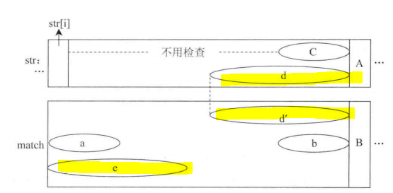
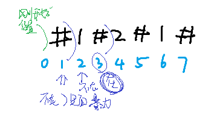
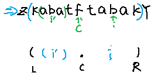
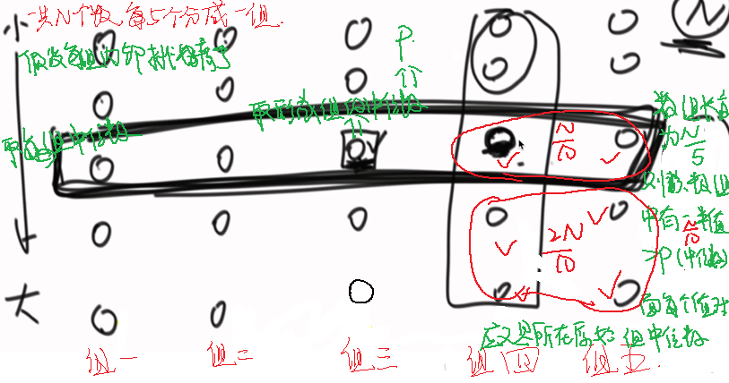
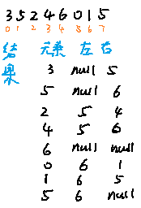
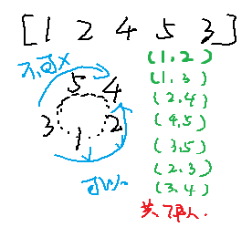
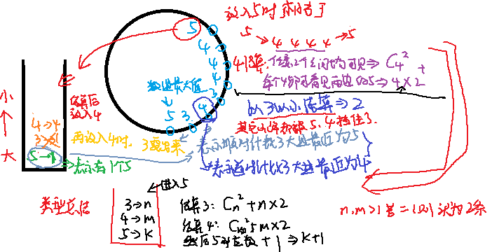

# AlgorithmMediumDay01


## 一、KMP

### （一）基本知识

- 子序列：可以连续可以不连续；
- 子数组（子串）：必须是连续的；
- 但是题目中子序列和子数组可能不区分；


### （二）作用

- 解决原始问题：给定两个字符串 str 和 match，长度分别为 N 和 M，实现一个算法，如果字符串 str 中含有子串 match，则返回 match 在 str 中的开始位置，不含有则返回 -1。

  **举例**

  str=”acbc”, match=”bc”，返回 2。

  str=”acbc”, mathc=”bcc”, 返回 -1。

  **要求**

  如果 match 的长度大于 str 的长度（M > N），str 必然不会含有 match，则直接返回 -1，但是如果 N >= M，要求算法复杂度为 O(N)。


### （三）常规解法

每次都是从头开始一个个匹配，但是时间复杂度太高，最差的情况下是：$$O(N * M)$$

**大致思路**：从左到右遍历 str 的每一个字符，然后看如果以当前字符作为第一个字符出发是否匹配出 match。比如str="aaaaaaaaaaaaaaaaab"，match="aaaab"。从 str[0] 出发， 开始匹配，匹配到 str[4]='a' 时发现和 match[4]='b' 不一样，所以匹配失败，说明从 str[0] 出发是不行的。从 str[1] 出发，开始匹配，匹配到 str[5]='a' 时发现和 match[4]='b' 不一样， 所以匹配失败，说明从 str[1] 出发是不行的。从str[2...12]出发，都会一直失败。从 str[13] 出 发，开始匹配，匹配到 str[17]=='b'，时发现和 match[4]='b'—样，match己经全部匹配完，说 明匹配成功，返回13。普通解法的时间复杂度较高，从每个字符串发时，匹配的代价都可能是O(M)，那么一共有N个字符，所以整体的时间复杂度为 O（N*M）。普通解法的时间复杂度这么高，是因为每次遍历到一个字符时，检查工作相当于从无开始，之前的遍历检查 不能优化当前的遍历检查。

**总结**： 我们发现每次匹配前面的并没有给后面一些指导信息


### （四）KMP算法思路

- **首先根据 match 生成最大前后缀匹配长度数组 ：**

  首先生成 match 字符串的 nextArr 数组，这个数组的长度与 match 字符串的长度一 样，nextArr[i] 的含义是在 match[i] 之前的字符串 match[0..i-1]中，心须以 match[i-1] 结尾的后缀子串（不能包含match[0]）与必须以 match[0] 开头的前缀子串（不能包含match[i - 1]）最大匹配长度是多少。这个长度就是 nextArr[i] 的值。比如，match="aaaab"字符串，nextArr[4] 的值该是多少呢？`match[4]=="b"`，所以它之前的字符串为 "aaaa"，根据定义这个字符串的后缀子串和前缀子串最大匹配为 "aaa"。也就是当后缀子串等于 match[1...3] = "aaa"，前缀子串等于 `match[0..2]=="aaa"` 时，这时前缀和后缀不仅相等，而且是所有前缀和后缀的可能性中

注：数组中值表示一个字符之前的所有字符串的最长前缀和最长后缀的匹配长度（前缀不包括数组中最后一个字符，后缀不包含第一个字符）

示例：对于数组： a b c a b c d，则元素 d  的最长XXXX为 3

前缀： a       ab         abc             abca          abcab   不能包含最后一个，至此截止，所以最长为 3.    

后缀： c        bc         abc             cabc          bcabc

值：  不等   不等    相等，为3     不等           不等


**2  从str[i]字符出发---匹配到j位置上发现开始出现不匹配：**

假设从 str[i] 字符出发时候，匹配到 j  位置的字符发现与 match 中的字符不一致，也就是说， str[i] 与 match[0] 一样，并且从这个位置开始一直可以匹配，即 str[i..j-1] 与 match[0..j-i-1] 一样，知道发现 str[j] != match[j -i]，匹配停止，如图所示。


**3 下一次 match 数组往右滑动， 滑动大小为 match 当前字符的最大前后缀匹配长度，再让 str[j] 与 match[k] 进行下一次匹配~**

那么下一次的匹配检查不再像普通解法那样退回到str[i+1]重新开始与 match[0] 的匹配过程，而是直接让 str[j] 与 match[k] 进行匹配检查，如图所示.在图中，在 str 中要匹配的位置仍是 j，而不进行退回。对 match来说，相当于向右滑动，让 match[k] 滑动到与 str[j] 同一个位置上，然后进行后续的匹配检查。普通解法 str 要退回到 i+1 位置，然后让 str[i+1] 与 match[0] 进行匹配，而我们的解法在匹配的过程中一直进行这样的滑动匹配的过程，直到在 str 的某一个位置把 match 完全匹配完，就说明str 中有 match。如果 match 滑到最后也没匹配出来，就说明str 中没有 match。


**4 注意为什么加快，主要是str[i]--c前那段不用考虑，因为肯定不能匹配~**

**若有匹配 则出现更大的前后缀匹配长度 ，与最初nextArr[] 定义违背。**



**关于nextArr数组的求解：**


#### 讨论计算复杂度：


代码

```java
package nowcoder.advanced.class01;

public class KMP {
    public static int getIndexOf(String s, String m) {
        if (s == null || m == null || m.length() < 1 || s.length() < m.length()) {
            return -1;
        }
        char[] ss = s.toCharArray();
        char[] ms = m.toCharArray();
        int si = 0;
        int mi = 0;
        int[] next = getNextArray(ms);
        while (si < ss.length && mi < ms.length) {
            if (ss[si] == ms[mi]) {
                si++;
                mi++;
                // 数组中值等于 -1 ，说明是第一个元素，说明当前 str1  中值连 str2 第一个字母都匹配不上，则直接从 str1 的下一个开始进行匹配
            } else if (next[mi] == -1) {
                si++;
            } else {
                mi = next[mi];
            }
        }
        return mi == ms.length ? si - mi : -1;
    }


    // 求解 next 数组方法
    public static int[] getNextArray(char[] str2) {
        if (str2.length == 1) {
            return new int[]{-1};
        }
        int[] next = new int[str2.length];
        next[0] = -1;
        next[1] = 0;
        // 需要求值的位置
        int pos = 2;
        int cn = 0;
        while (pos < next.length) {
            if (str2[pos - 1] == str2[cn]) {
                next[pos++] = ++cn;
            } else if (cn > 0) {
                cn = next[cn];
            } else {
                next[pos++] = 0;
            }
        }
        return next;
    }

    public static void main(String[] args) {
        int indexOf = getIndexOf("abcabdad", "bd");
        System.out.println(indexOf);
    }
}


```


### （五）相关题目

- （京东）给定一个字符串 如何加最短的字符（只能在原始串的后面进行添加）使其构成一个长的字符串且包含两个原始字符串，并且开始位置还得不一样

  示例：abcabc ---->abcabcabc 最少增加 3 个

**思路：**其实就是最大前后缀长度数组

**步骤**：求原字符串每一个的 next 数组，得到原字符串最大长度**后一个**的 next 数组值。该值表明原字符串的最大可复用长度（next 数组的意义），然后用原字符串长度减去最大可复用长度，得到应该添加字符的长度，即从原字符串倒数取得，添加即可。

总结： 在 KMP 中 nextArr 数组基础上多求一位终止位，将不是的补上即可

- 给定两个树（值可以相同或者不同） 判断数 1 的某棵子树是否包含树 2（结构和值完全相同），  是则返回true

子树就是从某个头结点开始下面所有子节点都要，下图第一个图就是可以 true，另一个图就是 false。


**思路**： 把一棵树序列化（可以先序、中序、后续）为字符串（字符数组）  。如果 str2 是 str1的子串 则T2也是T1的子树。


- 判断一个大字符串是否由一个小字符串重复得到，就是某个字符串是否为某个小字符串 * n 得到；

**思路**：转换为 一个前缀和后缀相差整数倍的问题


## 二、Manacher算法：

### （一）Manacher 算法应用

给定一个字符串 str，返回 str 中最长回文子串的长度。

常规思路： 

- 总是从中间那个字符出发，向两边开始扩展，观察回文，然后每个字符都得进行一遍

   但是奇数位数字完全可以  偶数位数字不可以，例如 1221 对应的每位扩充结果为：1 1 1 1 ，但是结果为 4.会出错

-  经过规律发现 无论是哪种情况 总是 `最大值/2` 即为最大回文串长度

前提是要处理字符串形式，加入特殊字符占位 #（其实什么字符都行）进行填充（在开头结尾和每个中间加入）

 这种方法是暴力法，时间复杂度为$$O(n^2)$$-----而Manacher算法可以降到O(n)


**概念汇总**

- 回文直径：从某个值开始往两边扩充，能扩充的最长值；

- 回文半径：见图


- 回文半径数组：还是从头到最后挨个求每个位置的回文半径，然后存入一个数组中

- 最右回文半径：如图所示，刚开始默认在 -1 位置，然后当到 0 位置，回文半径只能到 0 位置，所以最右的回文半径为 0  位置，当到 1 位置时候，回文半径扩充到 2 位置，则最右回文半径扩充到 2 位置，当移动到 3 位置时候，最右回文半径为 6


- 最右回文半径的中心：上面最后一个取得最右边界时候中心为 3，后面 4,5,6 的最右边界可能也是该位置，但是仅仅记录第一个使得最右回文边界到的中心，即 3。


### （二）Manacher 算法详解

针对 i 位置的回文串求法

- 如果 i 位置当前不在最右回文半径中，只能采用上面的方式暴力破：O(N )

    

- i 位置在回文右边界内：则设当前回文中心为 C，则 i 位置肯定是在回文中心 C 和回文右边界之间，做 i 位置关于中心 C 的对称点 i’，则针对 i’ 的所在的回文区域与整个回文区域关系有不同情况

    - i' 所在的回文区域在整个回文区域之间：O(1)

        

**则 i 回文长度大小和 i’ 回文长度相同**。证明：使用对称和区间内小回文，整个大区间大回文的结论可以证明 i 对应的区域是回文，并且是最大的。

- ​		i' 所在的回文区域在整个回文区域相交：O(1)

    

**则 i 回文长度为 i 到 R 长度**。

- i' 所在的回文区域与整个回文区域之间边界重叠

    

这种情况下，只能保证 i 到 R  区间的数据不需要进行暴力破，相当于可以从 R + 1 位置开始判断。


代码：

```java
package nowcoder.advanced.class01;

/**
 * @Author GJXAIOU
 * @Date 2020/1/1 14:22
 */
public class Manacher {
    public static char[] manacherString(String str) {
        char[] charArr = str.toCharArray();
        // 存放加入特殊字符的数组
        char[] res = new char[str.length() * 2 + 1];
        int index = 0;
        for (int i = 0; i != res.length; i++) {
            // (i & 1) == 0 用于判断 i 的奇偶性，因为如果 i 为奇数，则其二进制最后一位比为 1，则相当于 XXX1 & 0001，结果肯定为 1。
            res[i] = (i & 1) == 0 ? '#' : charArr[index++];
        }
        return res;
    }

    public static int maxLcpsLength(String str) {
        if (str == null || str.length() == 0) {
            return 0;
        }
        char[] charArr = manacherString(str);
        // 回文半径数组
        int[] pArr = new int[charArr.length];
        // index  为对称中心 C
        int index = -1;
        int pR = -1;
        int max = Integer.MIN_VALUE;
        for (int i = 0; i != charArr.length; i++) {
            // 2 * index - 1 就是对应 i' 位置，R> i,表示 i 在回文右边界里面，则最起码有一个不用验的区域，
            pArr[i] = pR > i ? Math.min(pArr[2 * index - i], pR - i) : 1;
            // 四种情况都让扩一下，其中 1 和 4 会成功，但是 2 ，3 会失败则回文右边界不改变；可以自己写成 if-else 问题。
            while (i + pArr[i] < charArr.length && i - pArr[i] > -1) {
                if (charArr[i + pArr[i]] == charArr[i - pArr[i]]) {
                    pArr[i]++;
                } else {
                    break;
                }
            }
            if (i + pArr[i] > pR) {
                pR = i + pArr[i];
                index = i;
            }
            max = Math.max(max, pArr[i]);
        }
        return max - 1;
    }

    public static void main(String[] args) {
        int length = maxLcpsLength("123abccbadbccba4w2");
        System.out.println(length);
    }
}

```


### （三）题目拓展

一个字符串，只能向后面添加字符，怎么将整个串都变成回文串，要求添加字符最短。

示例： ‘abc12321’  应添加  ‘cba’  变成  ’abc12321cba‘

即求，在包含最后一个字符情况下，最长回文串多少，前面不是的部分，逆序添加即可。

用manacher求得回文边界，发现边界与字符串最后位置，停止，求得回文中心C与有边界R，找到回文字符串，用原字符串减去该部分，在逆序就是结果。

```java
package nowcoder.advanced.class01;

/**
 * @Author GJXAIOU
 * @Date 2020/1/1 14:11
 */
public class LastAddString {
    public static char[] manacherString(String str) {
        char[] charArr = str.toCharArray();
        char[] res = new char[str.length() * 2 + 1];
        int index = 0;
        for (int i = 0; i != res.length; i++) {
            res[i] = (i & 1) == 0 ? '#' : charArr[index++];
        }
        return res;
    }

    public static String shortestEnd(String str) {
        if (str == null || str.length() == 0) {
            return null;
        }
        char[] charArr = manacherString(str);
        int[] pArr = new int[charArr.length];
        int index = -1;
        int pR = -1;
        int maxContainsEnd = -1;
        for (int i = 0; i != charArr.length; i++) {
            pArr[i] = pR > i ? Math.min(pArr[2 * index - i], pR - i) : 1;
            while (i + pArr[i] < charArr.length && i - pArr[i] > -1) {
                if (charArr[i + pArr[i]] == charArr[i - pArr[i]]) {
                    pArr[i]++;
                } else {
                    break;
                }
            }
            if (i + pArr[i] > pR) {
                pR = i + pArr[i];
                index = i;
            }
            if (pR == charArr.length) {
                maxContainsEnd = pArr[i];
                break;
            }
        }
        char[] res = new char[str.length() - maxContainsEnd + 1];
        for (int i = 0; i < res.length; i++) {
            res[res.length - 1 - i] = charArr[i * 2 + 1];
        }
        return String.valueOf(res);
    }

    public static void main(String[] args) {
        String yuanlai = LastAddString.shortestEnd("abcd123321");
        System.out.println(yuanlai);
    }
}
```


## 三、BFPRT算法：

### （一）BFPRT 算法详解与应用：

 **这个算法其实就是用来解决 ： 求解最小/最大的 k 个数问题，不是第 K 个数。**

- 最暴力的方法是：遍历然后查找：$$O(N*log^N)$$

- 常规的做法 就是 平均时间复杂度为 O(n) 的 partition 函数的应用，划分结果为小于某个数的放左边，等于某个数的放中间，大于某个数的放右边，然后看等于的左右边界，例如第一次划分结果左右边界为：500 ~ 600 位，查找的是第 300 小的数，则将小于区域按照上面方式再次使用 partition 函数进行划分，如果等于区域命中就结束过程，依次类推。  
    - 缺点：是概率式的，无法避免最差的情况（因为每次选取的划分值是随机的，很难保证大于和小于该值的区间长度差不多）。因此最终期望为：$$O(N)$$

- BFPRT算法优点是确定性的，严格的 $$O(N)$$。


大概思路：

 将整个数组以5个数字一组划分 ,最后不满 5 个的单独成组，分别进行组内排序（组间不排序） ，因为只是 5 个数排序，所有时间复杂度为O(1)， 同时因为整个数组分为N/5组，所以则总共时间复杂度为O(N)。

3) 把每个组内的中位数拿出来构成一个新数组，若为偶数则拿其上中位数即可，数组长度为 N/5

4）递归调用该bfprt函数，传入刚才的中位数数组 和 中位数数组长度的一半 （继续求中位数）【BFPRT 函数格式为： int BFPRT（arr,k) 输入数组 arr 和要求的第 k 小的值】

5）将4）返回的值作为原始数组划分值，一直以该值作为 paritition 函数的划分值。


例子：


每一步的时间复杂度为：假设原始数据量为 N，则

- 步骤一：O(1)

- 步骤二：O(N)

- 步骤三：O(N)

- 步骤四：因为是递归：T（N/5），最终获取划分值 P

- 步骤五：在 partition 算法中如果不是值正好在相等区域的情况下，则不是在小于就是在大于区间上，同时两个区间后续只有一个需要再次判断，另一个区间直接舍弃。

    判断最差的情况：左侧最差情况，就是找到最多能有多少数是小于划分值 P（即）最少多少数的确定大于划分值 P 的，所以至少共 3N/10 大于划分值。所以左边比它小的最多有7N/10。右边类似。
    
    所以最终该步骤左右时间复杂度为：$$T(\frac{7N}{10})$$ ，因为只算一个，所以最终仍然是：$$T(\frac{7N}{10})$$ 。
    
    所以整体时间复杂度为：$$T(N) = T(\frac{N}{5}) + T(\frac{7N}{10}) + O(N)$$，结果为 O(N)，证明见算法导论。


优点 :我们选择的基准一定将数组划分为 一定规模的子部分



由上图我们可以看到： 最中间的中位数--- 右边比它大的**至少**有N/10 * 3 个（每个组又有两个大于该组中位数的数字）

​                                右边比它小的最多有N/10 * 7

​                             ---- 同理左边也是~

如下例子：  7为中位数 ----比它大的至少有 8 9 12 13 14 这几个数


重点掌握思路 可以面试的时候告诉面试官~~


**代码：** ==还是有问题==

```java
package nowcoder.advanced.class01;

import java.sql.SQLOutput;

/**
 * @Author GJXAIOU
 * @Date 2020/1/1 16:13
 */
public class BFPRT {
    // 使用堆的方式来求解该题，时间复杂度为：O(N * logN)
    public static int[] getMinKNumsByHeap(int[] arr, int k) {
        if (k < 1 || k > arr.length) {
            return arr;
        }
        int[] kHeap = new int[k];
        for (int i = 0; i != k; i++) {
            heapInsert(kHeap, arr[i], i);
        }
        for (int i = k; i != arr.length; i++) {
            if (arr[i] < kHeap[0]) {
                kHeap[0] = arr[i];
                heapify(kHeap, 0, k);
            }
        }
        return kHeap;
    }

    public static void heapInsert(int[] arr, int value, int index) {
        arr[index] = value;
        while (index != 0) {
            int parent = (index - 1) / 2;
            if (arr[parent] < arr[index]) {
                swap(arr, parent, index);
                index = parent;
            } else {
                break;
            }
        }
    }

    public static void heapify(int[] arr, int index, int heapSize) {
        int left = index * 2 + 1;
        int right = index * 2 + 2;
        int largest = index;
        while (left < heapSize) {
            if (arr[left] > arr[index]) {
                largest = left;
            }
            if (right < heapSize && arr[right] > arr[largest]) {
                largest = right;
            }
            if (largest != index) {
                swap(arr, largest, index);
            } else {
                break;
            }
            index = largest;
            left = index * 2 + 1;
            right = index * 2 + 2;
        }
    }

    // ------------------分割线---------------------

    public static int[] getMinKNumsByBFPRT(int[] arr, int k) {
        if (k < 1 || k > arr.length) {
            return arr;
        }
        int minKth = getMinKthByBFPRT(arr, k);
        int[] res = new int[k];
        int index = 0;
        for (int i = 0; i != arr.length; i++) {
            if (arr[i] < minKth) {
                res[index++] = arr[i];
            }
        }
        for (; index != res.length; index++) {
            res[index] = minKth;
        }
        return res;
    }

    public static int getMinKthByBFPRT(int[] arr, int K) {
        int[] copyArr = copyArray(arr);
        return bfprt(copyArr, 0, copyArr.length - 1, K - 1);
    }

    public static int[] copyArray(int[] arr) {
        int[] res = new int[arr.length];
        for (int i = 0; i != res.length; i++) {
            res[i] = arr[i];
        }
        return res;
    }

    // 在 begin 到 end 范围内求第 i 小的数
    public static int bfprt(int[] arr, int begin, int end, int i) {
        if (begin == end) {
            return arr[begin];
        }
        // 划分值
        int pivot = medianOfMedians(arr, begin, end);
        int[] pivotRange = partition(arr, begin, end, pivot);
        if (i >= pivotRange[0] && i <= pivotRange[1]) {
            return arr[i];
        } else if (i < pivotRange[0]) {
            return bfprt(arr, begin, pivotRange[0] - 1, i);
        } else {
            return bfprt(arr, pivotRange[1] + 1, end, i);
        }
    }

    public static int medianOfMedians(int[] arr, int begin, int end) {
        int num = end - begin + 1;
        int offset = num % 5 == 0 ? 0 : 1;
        int[] mArr = new int[num / 5 + offset];
        for (int i = 0; i < mArr.length; i++) {
            int beginI = begin + i * 5;
            int endI = beginI + 4;
            mArr[i] = getMedian(arr, beginI, Math.min(end, endI));
        }
        return bfprt(mArr, 0, mArr.length - 1, mArr.length / 2);
    }

    public static int[] partition(int[] arr, int begin, int end, int pivotValue) {
        int small = begin - 1;
        int cur = begin;
        int big = end + 1;
        while (cur != big) {
            if (arr[cur] < pivotValue) {
                swap(arr, ++small, cur++);
            } else if (arr[cur] > pivotValue) {
                swap(arr, cur, --big);
            } else {
                cur++;
            }
        }
        int[] range = new int[2];
        // 等于区域最左边
        range[0] = small + 1;
        // 等于区域最右边
        range[1] = big - 1;
        return range;
    }

    public static int getMedian(int[] arr, int begin, int end) {
        insertionSort(arr, begin, end);
        int sum = end + begin;
        int mid = (sum / 2) + (sum % 2);
        return arr[mid];
    }

    public static void insertionSort(int[] arr, int begin, int end) {
        for (int i = begin + 1; i != end + 1; i++) {
            for (int j = i; j != begin; j--) {
                if (arr[j - 1] > arr[j]) {
                    swap(arr, j - 1, j);
                } else {
                    break;
                }
            }
        }
    }

    public static void swap(int[] arr, int begin, int end) {
        arr[begin] = arr[begin] ^ arr[end];
        arr[end] = arr[begin] ^ arr[end];
        arr[begin] = arr[begin] ^ arr[end];
    }
    public static void printArray(int[] array){
        for (int i = 0; i < array.length; i++) {
            System.out.print(array[i] + " ");
        }
        System.out.println();
    }

    public static void main(String[] args) {
        int[] demo ={6,9,1,3,1,2,2,5,6,1,3,5,9,7,2,5,6,1,9};
        printArray(getMinKNumsByHeap(demo, 10));
        printArray(getMinKNumsByBFPRT(demo, 10));
    }
}

```

注意： 此时的partition和常规的partition函数不太一样 多了一个我们定义的基准划分值

​      且以此基准值划分 比它小的在左边 比它大的在右边 和它相等的在中间并将相等的左右边界存放在一个数组中

====第二课==


## 窗口： 

**介绍窗口以及窗口内最大值或者最小值的更新结构（单调双向队列）**

**什么是窗口：**

就是一个数组------有L和R指针，默认两个指针均位于数组的最左边即下标为 -1 的位置， 当有数字进入时R向右移动  当有数字删除时则L向右移动 且L 和R 不会回退且 L 不能到 R 右边~


思路： **双端队列（链表）**：双端队列中既需要放置数据又需要放置位置下标，本质上存放下标就行，对应值从数组中就能获取。

**可以从头 尾入 可以从尾 头出**

**规则： L< R  且 L,R 永远不回退~**


**分析逻辑为：** 如果想实现窗口内最大值的更新结构： 使得双端队列保证从大到小的顺序 

当放入元素时候 ：

​           （R增加） 头部始终存放的是当前最大的元素--- 如果即将进入双端队列的元素（因为 R 增加而从数组中取出放入双端队列中的元素）比上一个进入双端队列的元素小，则从尾部进入，新进入的元素直接连接在后面，否则 原来双端队列的尾部一直弹出（包含相等情况，因为晚过期） 直到为即将要放入的元素找到合适的位置，或者整个队列为空，然后放入新加入的元素。（见上面示例）

当窗口减数时候：

​            （L增加） ---L向右移---（index下标一定得保留）则需要检查当前头部元素index是否过期 若过期则需要从头部进行弹出


**时间复杂度**：因为从到到位滑过，每个数只会进队列一次，出队列一次，在队列中删除的数是不找回的，因此时间复杂度为：$$O(N)$$


#### **具体应用：**

#### **生成窗口最大值数组：** 

**题目**

有一个整型数组 arr 和一个大小为 w 的窗口从数组的最左边滑到最右边，窗口每次向右滑一个位置。

例如，数组为 [4,3,5,4,3,3,6,7]，窗口大小为 3 时候：

[4 3 5] 4 3 3 6 7   窗口中最大值为：5

4 [3 5 4] 3 3 6 7   窗口中最大值为：5

4 3 [5 4 3] 3 6 7   窗口中最大值为：5

4 3 5 [4 3 3] 6 7   窗口中最大值为：4

4 3 5 4 [3 3 6] 7   窗口中最大值为：6

4 3 5 4 3 [3 6 7]   窗口中最大值为：7

如果数组长度为 n，窗口大小为 w，则一共产生 n - w + 1 个窗口的最大值。

请实现一个函数：

输入：整型数组 arr，窗口大小为 w。

输出：一个长度为 n - w + 1 的数组 res，res[i]表示每一种窗口状态下的最大值。

上面的结果应该返回{5,5,5,4,6,7}

**代码：**

```java
package nowcoder.advanced.class02;

import java.util.LinkedList;

/**
 * @Author GJXAIOU
 * @Date 2020/1/1 20:29
 */
public class SlidingWindowMaxArray {
    public static int[] getMaxWindow(int[] arr, int w) {
        if (arr == null || w < 1 || arr.length < w) {
            return null;
        }
        // LinkedList 就是一个标准的双向链表
        LinkedList<Integer> qmax = new LinkedList<Integer>();
        // 生成的结果数组
        int[] res = new int[arr.length - w + 1];
        int index = 0;
        for (int i = 0; i < arr.length; i++) {
            //更新双端队列，如果双端队列不为空，并且尾结点(存的是下标)对应数组中的值是否小于等于当前值
            while (!qmax.isEmpty() && arr[qmax.peekLast()] <= arr[i]) {
                qmax.pollLast();
            }
            // 上面一直弹出，直到不符合然后加上当前值。
            qmax.addLast(i);
            // 上面加法是通用的，但是减法是针对该题定制的
            // 当过期的时候（当窗口形成之后再扩充才算过期），窗口形成过程中不会过期
            if (qmax.peekFirst() == i - w) {
                qmax.pollFirst();
            }
            //判断下标过期
            if (i >= w - 1) {
                res[index++] = arr[qmax.peekFirst()];
            }
        }
        return res;
    }

    public static void printArray(int[] array) {
        for (int i = 0; i < array.length; i++) {
            System.out.print(array[i] + " ");
        }
        System.out.println();
    }

    public static void main(String[] args) {
        int[] arr = {4, 3, 5, 4, 3, 3, 6, 7};
        printArray(getMaxWindow(arr, 3));
    }
}
```


## 最大值-最小值<=num的子数组数量:

**题目**：给定数组 arr 和整数 num，共返回有多少个子数组满足如下情况：`max(arr[i...j]) - min(arr[i...j]) <= num`，其中 `max(arr[i...j])` 表示子数组 `arr[i...j]` 中最大值，`min(arr[i...j])` 表示子数组 `arr[i...j]` 中的最小值。

**要求**：如果数组长度为 N，请实现时间复杂度为 O（N）的解法。


- 子数组（必须连续）一共有：$$N^2$$ 个（0~1,0~2，。。。0~n；1~1，。。。）


#### 最简单思路： 暴力求解 两个for 依次遍历 

```java
package nowcoder.advanced.class02;

/**
 * @Author GJXAIOU
 * @Date 2020/1/1 20:59
 */
public class AllLessNumSubArray {
    // 暴力解法:O(N^3)
    public static int getNum1(int[] arr, int num) {
        int res = 0;
        // 双层 for 循环穷尽所有的子数组可能性。
        for (int start = 0; start < arr.length; start++) {
            for (int end = start; end < arr.length; end++) {
                if (isValid(arr, start, end, num)) {
                    res++;
                }
            }
        }
        return res;
    }

    public static boolean isValid(int[] arr, int start, int end, int num) {
        int max = Integer.MIN_VALUE;
        int min = Integer.MAX_VALUE;
        for (int i = start; i <= end; i++) {
            max = Math.max(max, arr[i]);
            min = Math.min(min, arr[i]);
        }
        return max - min <= num;
    }
}

```


分析时间复杂度： o(N3) n的3次方


#### 最优解思路：

- 如果有一个子数组 L~R 已经符合要求（并且其最大值为 max，最小值为 min），则其中内部的子数组一定也符合要求，因为内部空间（即范围小于 L ~ R）中的最大值只会 <= max，并且最小值只会 >=min，所有相减的结果肯定小于等于 num。

- 同理如果已经不达标 则往两边扩也肯定不达标（因为扩大返回只会导致 max 值变大，min 值变小）。

- 总计规律： 就是L一直往右走 不回退 R也跟着往右扩大范围

首先数组左边固定在 0 位置，然后右边界一直扩充，但是同时维护一个窗口内最大值更新结构和窗口内最小值更新结构，使得每次扩充值之后都可以比较当前数组是否满足最大值 - 最小值 <= max 的情况，比如当到 X 下标的时候是满足的，但是 X + 1 下标就不满足的时候，则表示以 0 开头的满足的子数组数目为 X +1 个（0 ~ 0,0 ~1，。。0 ~X）。

然后 L 缩一个位置，到 1 的位置，然后更新现有的最大和最小窗口更新结构（因为更新结构中 0 下标的值需要弹出），然后 R 继续向右走进行判断，直到不可以了就可以得到所有以 1 开头的子数组个数。

其他类型，以此类推。


代码：

```java
package nowcoder.advanced.class02;

import java.util.LinkedList;

/**
 * @Author GJXAIOU
 * @Date 2020/1/1 20:59
 */
public class AllLessNumSubArray {
    // 暴力解法:O(N^3)
    public static int getNum1(int[] arr, int num) {
        int res = 0;
        // 双层 for 循环穷尽所有的子数组可能性。
        for (int start = 0; start < arr.length; start++) {
            for (int end = start; end < arr.length; end++) {
                if (isValid(arr, start, end, num)) {
                    res++;
                }
            }
        }
        return res;
    }

    public static boolean isValid(int[] arr, int start, int end, int num) {
        int max = Integer.MIN_VALUE;
        int min = Integer.MAX_VALUE;
        for (int i = start; i <= end; i++) {
            max = Math.max(max, arr[i]);
            min = Math.min(min, arr[i]);
        }
        return max - min <= num;
    }

    /**
     * 使用双向最大最小值更新结构，时间复杂度为 O（N）
     */
    public static int getNum(int[] arr, int num) {
        if (arr == null || arr.length == 0) {
            return 0;
        }
        // 分别准备最大值和最小值更新结构
        LinkedList<Integer> qmax = new LinkedList<Integer>();
        LinkedList<Integer> qmin = new LinkedList<Integer>();
        int L = 0;
        int R = 0;
        int res = 0;
        while (L < arr.length) {
            while (R < arr.length) {
                while (!qmin.isEmpty() && arr[qmin.peekLast()] >= arr[R]) {
                    qmin.pollLast();
                }
                qmin.addLast(R);
                while (!qmax.isEmpty() && arr[qmax.peekLast()] <= arr[R]) {
                    qmax.pollLast();
                }
                qmax.addLast(R);
                // 不达标
                if (arr[qmax.getFirst()] - arr[qmin.getFirst()] > num) {
                    break;
                }
                R++;
            }
            if (qmin.peekFirst() == L) {
                qmin.pollFirst();
            }
            if (qmax.peekFirst() == L) {
                qmax.pollFirst();
            }
            res += R - L;
            // 换一个开头
            L++;
        }
        return res;
    }
}

```


# 单调栈：

问题描述：给定一个数组 请确定每个元素左右距离最近的比它大的数字



**常规想法：** 到某一个元素时，通过两个for 分别获取其左边比它大的和右边比他大的数字 时间复杂度为 $$O(n^2)$$


**最优解思路（单调栈）**，栈中实际放置下标即可。O(N)

- 首先一个按照从大到小顺序排序的栈结构 ，若在压栈过程中发现要压栈的元素和栈顶的元素相比要大，则弹出当前栈顶元素，并从开始弹出处记录，要压栈的元素就是其右边离栈顶元素最近比它大的数，之后继续弹出的下一个即为栈顶元素左边距离最近的一个元素。


注意： 到数组末尾时 但是栈中依然有元素 则此时元素弹出 右为null 而左边为栈中的下一元素

记得 观察 这个元素弹出的驱动是啥？  之前的是因为右边要压栈的比栈顶元素要大 所以可以弹出并记录信息


**特殊情况：**若出现相等元素情况，则将下标放在一起，等到出现比它们大的数字时再都依次弹出即可。


## 具体应用：

## **1  构造数组的maxtree:**

定义二叉树的节点如下：

```
public class Node{
    public int value;
    public Node left;
    public Node right;
    public Node(int data){
        this.value=data;
    }
}
```


一个数组的MaxTree定义：

- 数组必须没有重复元素
- MaxTree是一棵二叉树，数组的每一个值对应一个二叉树节点
- 包括MaxTree树在内且在其中的每一棵子树上，值最大的节点都是树的头

给定一个没有重复元素的数组arr，写出生成这个数组的MaxTree的函数，要求如果数组长度为N，则时间负责度为O(N)、额外空间负责度为O(N)。

## 实现思路

对每一个元素，从左边和右边各选择第一个比这个元素大的值，选择值较小的元素作为父节点。
  在【生成窗口最大数组】里面，已经掌握了，在O(N)时间复杂度里面，找到每个元素位置最近的比元素大的元素，同个这个套路，就可以构造一棵MaxTree了。

## 证明

1 构造的不是森林
2 是一棵二叉树

证明：1  
  对于每一个树节点，都能往上找到一个节点，直到找到最大节点为止，这样所有树节点都有共同的父节点，这样构造出来的就是一棵树。

证明：2
  使用反证法解决，如果是一棵二叉树，那么对于每个作为父节点的元素，能够在元素的一边找到两个或两个以上的元素。存在如：[p, b1, x, b2]这样的结构，p是父节点、b1、b2为子节点, x为其他节点。

- 按照题目，可以设定：
      p > b1, p > b2
- 当b1 > b2：
      b2不会选择p作为父节点，可能选择b1作为父节点.
- 当b1 < b2：
      当x < b2时，b1不会选择p作为父节点，选择b2作为父节点.
      当x > b2时，b2不会选择p作为父节点，选择x作为父节点.


​         


**注意**：树不要求一定要平衡

思路1 ： 按照大根堆思路建立 O(N)

思路2： 单调栈：O（N）

按照单调栈的思路找到每个元素左右最近比它大的元素---分以下几种情况进行讨论：

 1 若一个元素左右均是null 则它是全局最大的 直接作为根节点

 2 若一个元素左或者右 只存在一个 则只具有唯一的父节点

 3  若一个元素左右两个元素均存在 则选择其中最小的那个作为父节点


注意： 一定只能构成一棵树，不会成为多叉树或者森林：

因为数组中没有重复值，所有最大值肯定作为整棵树的头结点，而任何一个节点都会找到一个比它大的，然后放置在其下面，所以每个节点都有归属并且均以最大值为头结点 -》最终形成一棵树。

证明不是多叉树：即是证明每个结点下面最多只有两个子节点，即是证明每个结点的单侧只有一个数会挂在该结点的底下。


代码 ==核对一下==

```java
package nowcoder.advanced.class01;

import java.util.HashMap;
import java.util.Stack;

/**
 * @Author GJXAIOU
 * @Date 2020/1/3 15:05
 */
public class MaxTree {
    public static class Node {
        public int value;
        public Node left;
        public Node right;

        public Node(int data) {
            this.value = data;
        }
    }

    public static Node getMaxTree(int[] arr) {
        Node[] nArr = new Node[arr.length];
        for (int i = 0; i < arr.length; i++) {
            nArr[i] = new Node(arr[i]);
        }
        HashMap<Node, Node> lBigMap = new HashMap<Node, Node>();
        HashMap<Node, Node> rBigMap = new HashMap<Node, Node>();
        Stack<Node> stack = new Stack<Node>();
        for (int i = arr.length - 1; i >= 0; i--) {
            Node curNode = nArr[i];
            while ((!stack.isEmpty()) && stack.peek().value < curNode.value) {
                popStackSetMap(stack, lBigMap);
            }
            stack.push(curNode);
        }
        while (!stack.isEmpty()) {
            popStackSetMap(stack, lBigMap);
        }

        for (int i = nArr.length - 1; i != -1; i--) {
            Node curNode = nArr[i];
            while ((!stack.isEmpty()) && stack.peek().value < curNode.value) {
                popStackSetMap(stack, rBigMap);
            }
            stack.push(curNode);
        }
        while (!stack.isEmpty()) {
            popStackSetMap(stack, rBigMap);
        }

        Node head = null;
        for (int i = 0; i != nArr.length; i++) {
            Node curNode = nArr[i];
            Node left = lBigMap.get(curNode);
            Node right = rBigMap.get(curNode);
            if (left == null && right == null) {
                head = curNode;
            } else if (left == null) {
                if (right.left == null) {
                    right.left = curNode;
                } else {
                    right.right = curNode;
                }
            } else if (right == null) {
                if (left.left == null) {
                    left.left = curNode;
                } else {
                    left.right = curNode;
                }
            } else {
                Node parent = left.value < left.value ? left : right;
                if (parent.left == null) {
                    parent.left = curNode;
                } else {
                    parent.right = curNode;
                }
            }
        }
        return head;
    }

    public static void popStackSetMap(Stack<Node> stack, HashMap<Node, Node> map) {
        Node popNode = stack.pop();
        if (stack.isEmpty()) {
            map.put(popNode, null);
        } else {
            map.put(popNode, stack.peek());
        }
    }

    public static void printPreOrder(Node head) {
        if (head == null) {
            return;
        }
        System.out.print(head.value + " ");
        printPreOrder(head.left);
        printPreOrder(head.right);
    }

    public static void main(String[] args) {
        int[] uniqueArr ={3, 4, 5, 1, 2};
        Node head = getMaxTree(uniqueArr);
        printPreOrder(head);
        System.out.println();
        printPreOrder(head);
    }
}


```


代码：


   


## 2  求最大子矩阵的大小： 


**类似的，下图的直方图** （值可以相等），以每个矩阵的中心高度为杠---然后分别向左右去扩展，到比它小的时候就停止 ---并记录能够达成的最大格子数目


**解法:**   此题用单调栈，但是是找到左边和右边离他最近的比它小的数---从小到大的顺序  

若压栈元素<当前栈顶元素 则弹出栈顶元素 ，并且结算值，例如放入  1 -> 3 时候会弹出 0 -》4 则表示 0 位置数的距离其最近的比它小的数在 1 位置，同时 0-》 4 下面没有元素，表示最左边可以扩充到 -1 位置，因为 -1 和 1 位置都不可达，所以其真正能扩充的只有它自己。 

如果栈下面没有元素 则一定能够到达左边界 右边界就是那个压栈元素所在值  

若到最后栈里有元素 但是没有主动让元素弹出的右端元素 则可以最右到达右边界 左边就是下面的元素（两边不可达）


**转换到原始问题中** ：

数组为 10 11 带入上面代码求出，以第 0 行为底的所有长方形中，含有1 最大的长方形；

则 对于1 行  2 1 2 2（表示以该行开始往上看有多少个连续的 1）带入上面代码求出以 第 1 行为底的。。。。

对于行 3 2 2 0 （注意此时为0 因为最上面是0 并没构成连续的1）

目的就是找到 每一行打底的最大的1的长方形


分析时间复杂度：因为每行运算都是 O（m），然后一共 N 行，所以是 O（n*m ) 就是遍历一遍矩阵


代码

```java
package nowcoder.advanced.class01;

import java.util.Stack;

/**
 * @Author GJXAIOU
 * @Date 2020/1/3 15:59
 */
public class MaximalRectangle {
    // 原问题（就是 0 1 矩阵）
    public static int maxRecSize(int[][] map) {
        if (map == null || map.length == 0 || map[0].length == 0) {
            return 0;
        }
        int maxArea = 0;
        int[] height = new int[map[0].length];
        for (int i = 0; i < map.length; i++) {
            for (int j = 0; j < map[0].length; j++) {
                // 形成辅助数组：就是 [10 11][2 1 2 2]等等
                height[j] = map[i][j] == 0 ? 0 : height[j] + 1;
            }
            maxArea = Math.max(maxRecFromBottom(height), maxArea);
        }
        return maxArea;
    }

    // 最基本方法，即一个数组代表直方图的话在其中找到最大矩形
    public static int maxRecFromBottom(int[] height) {
        if (height == null || height.length == 0) {
            return 0;
        }
        int maxArea = 0;
        // 准备一个单调栈，栈中放置下标
        Stack<Integer> stack = new Stack<Integer>();
        for (int i = 0; i < height.length; i++) {
            // 当栈不为空，且当前数小于等于栈顶
            while (!stack.isEmpty() && height[i] <= height[stack.peek()]) {
                // 弹出栈顶
                int j = stack.pop();
                // k 为左边界 （即弹出的数的下面是什么）
                int k = stack.isEmpty() ? -1 : stack.peek();
                // i 为当前数，就是右边界，自己在 k 位置上
                int curArea = (i - k - 1) * height[j];
                maxArea = Math.max(maxArea, curArea);
            }
            stack.push(i);
        }
        // 遍历完成之后，栈中剩余元素进行结算
        while (!stack.isEmpty()) {
            int j = stack.pop();
            int k = stack.isEmpty() ? -1 : stack.peek();
            int curArea = (height.length - k - 1) * height[j];
            maxArea = Math.max(maxArea, curArea);
        }
        return maxArea;
    }

    public static void main(String[] args) {
        int[][] map = {{1, 0, 1, 1}, {1, 1, 1, 1}, {1, 1, 1, 0}};
        int maxArea = maxRecSize(map);
        System.out.println("maxArea = " + maxArea);
    }
}

```


### 回形山

使用一个数组表示环形山，然后每座山上放烽火，相邻山之间的烽火可以看见；因为任意两座山之间可以通过顺时针或者逆时针的方式互相到达，如果两种方式中一条经过的数字都不大于两座山值的较小的一个，则两座山相互可见（如 3,4 之间可以看见），返回能返回相互看见的山峰有多少对。



如果数组中所有值都不相等：

1 座山峰规定为 0 对，2 座山峰规定为 1 对，如果大于 2 座，则 i 座山峰共 （ 2 * i - 3 ）对。

找发规定为：小的找大的，


但是实际问题中是可能含有最大值的，因此首先找到数组中的最大值，如果有多个取第一个，从该值开始进行环形遍历（例如：3  3 5  4  5，遍历顺序为：5 4  5 3  3）



针对遍历结束之后单调栈中剩余的元素，倒数第 3 及其以上的仍然适用于原来的公式，其余倒数第 2 和倒数第 1 单独计算。


```java
package nowcoder.advanced.class01;

import java.awt.*;
import java.util.Scanner;
import java.util.Stack;

/**
 * @Author GJXAIOU
 * @Date 2020/1/3 17:44
 */
public class MountainsAndFlame {
    public static void main(String[] args) {
        // 输入两部分值：数组长度和数组具体的内容
        Scanner in = new Scanner(System.in);
        while (in.hasNextInt()) {
            int size = in.nextInt();
            int[] arr = new int[size];
            for (int i = 0; i < size; i++) {
                arr[i] = in.nextInt();
            }
            System.out.println(communications(arr));
        }
        in.close();
    }

    // 在环形数组中 i 位置的下一位，没到底则 +1，到底就为 0
    public static int nextIndex(int size, int i) {
        return i < (size - 1) ? (i + 1) : 0;
    }

    public static long getInternalSum(int n) {
        return n == 1L ? 0L : (long) n * (long) (n - 1) / 2L;
    }

    public static class Pair {
        public int value;
        public int times;

        public Pair(int value) {
            this.value = value;
            this.times = 1;
        }
    }

    // arr 为环形数组
    public static long communications(int[] arr) {
        if (arr == null || arr.length < 2) {
            return 0;
        }
        int size = arr.length;
        // 找到最大值位置（第一个）
        int maxIndex = 0;
        for (int i = 0; i < size; i++) {
            maxIndex = arr[maxIndex] < arr[i] ? i : maxIndex;
        }
        // value 为最大值
        int value = arr[maxIndex];
        int index = nextIndex(size, maxIndex);
        long res = 0L;
        // 首先将最大值扔入栈中
        Stack<Pair> stack = new Stack<Pair>();
        stack.push(new Pair(value));
        // 因为是从 maxIndex 的下一个位置开始遍历的，所有如果值再次相等说明遍历结束
        while (index != maxIndex) {
            // 数组中的当前值
            value = arr[index];
            while (!stack.isEmpty() && stack.peek().value < value) {
                int times = stack.pop().times;
                // res += getInernalSum(times) +times;
                // res += stack.isEmpty() ? 0 : times;
                // 下面结果为上面两句合并
                res += getInternalSum(times) + 2 * times;
            }
            // 如果当前值使得栈顶弹出，然后栈顶和弹出之后露出的栈顶值相同，则原来栈顶数目 +1
            if (!stack.isEmpty() && stack.peek().value == value) {
                stack.peek().times++;
                // 如果和弹出之后露出的栈顶值不相等，则将当前值放入栈中
            } else {
                stack.push(new Pair(value));
            }
            index = nextIndex(size, index);
        }
        // 遍历结束之后剩余栈中元素进行结算
        while (!stack.isEmpty()) {
            int times = stack.pop().times;
            res += getInternalSum(times);
            if (!stack.isEmpty()) {
                res += times;
                if (stack.size() > 1) {
                    res += times;
                } else {
                    res += stack.peek().times > 1 ? times : 0;
                }
            }
        }
        return res;
    }
}

```


