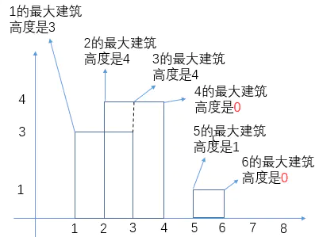
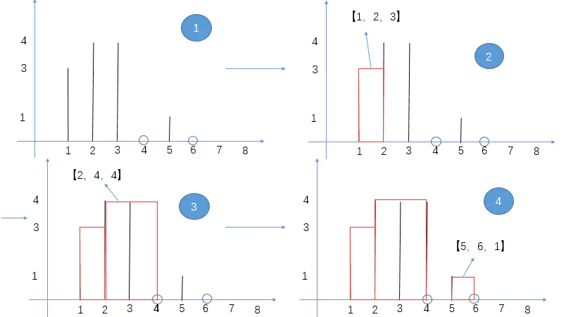
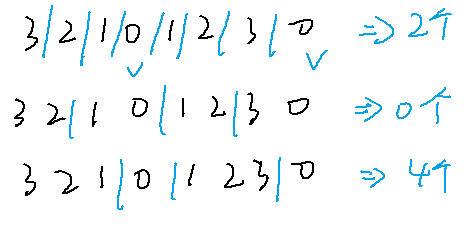
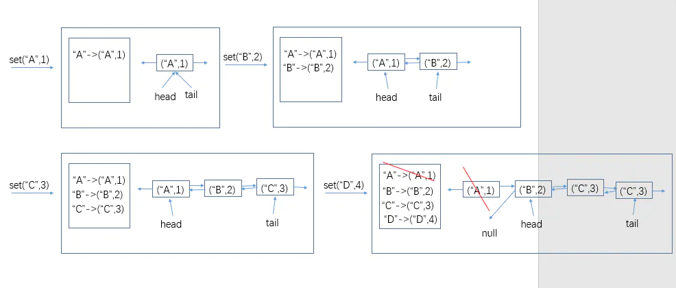
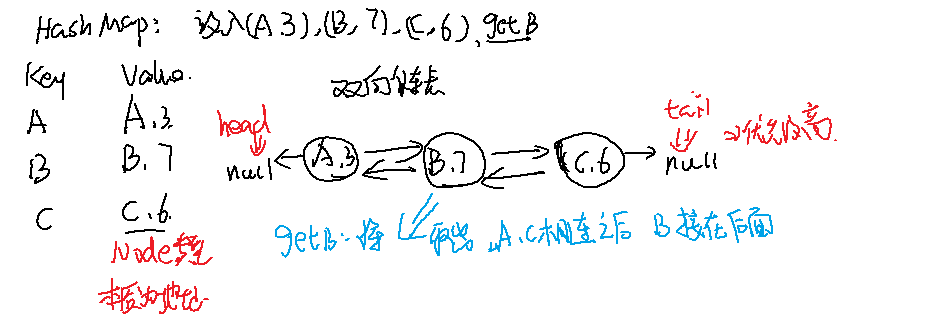
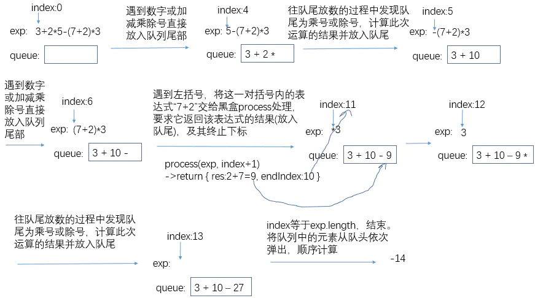
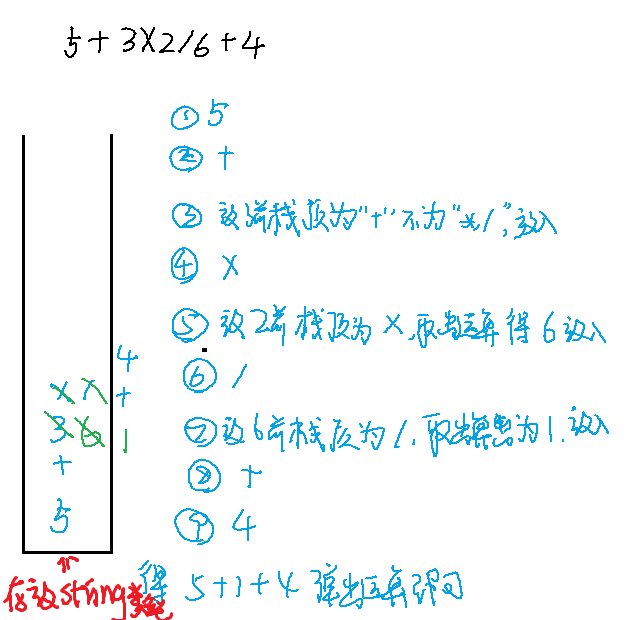
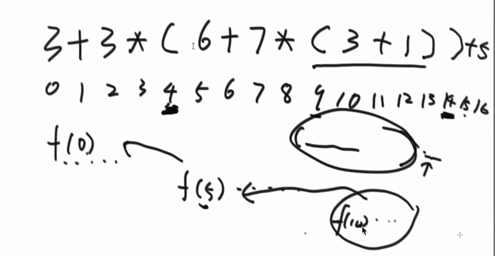

# AlgorithmMediumDay04

[TOC]


## 一、The Skyline Problem（大楼轮廓线问题）

【**问题**】给定一个 N 行 3 列二维数组，每一行表示有一座大楼，一共有 N 座大楼。 所有大楼的底部都坐落在 X 轴上，每一行的三个值 (a,b,c) 代表每座大楼的从 (a,0) 点开始，到 (b,0) 点结束，高度为 c。 输入的数据可以保证a < b, 且 a，b，c 均为正数。大楼之间可以有重合。 请输出整体的轮廓线。

【**示例**】给定一个二维数组 [ [1, 3, 3], [2, 4, 4], [5, 6,1] ]
输出为轮廓线 [ [1, 2, 3], [2, 4, 4], [5, 6, 1] ]


【**解析**】：

1. 将一座楼的表示`[start,end,height]`拆分成左右两个边界（边界包含：所处下标、边界高度、是楼的左边界还是右边界），比如`[1,3,3]`就可以拆分成`[1,3,true]`和`[3,3,false]`的形式（`true`代表左边界、`false`代表右边界）。

2. 将每座楼都拆分成两个边界，然后对边界按照边界所处的下标进行排序。比如`[[1,3,3],[2,4,4],[5,6,1]`拆分之后为`[[1,3,true],[3,3,false],[2,4,true],[,4,4,false],[5,1,true],[6,1,false]]`，排序后为`[[1,3,true],[2,4,true],[3,3,false],[4,4,false],[5,1,true],[6,1,false]]`

3. 将边界排序后，遍历每个边界的高度并依次加入到一棵`TreeMap`红黑树中（记为`countOfH`），以该高度出现的次数作为键值（第一次添加的高度键值为1），如果遍历过程中有重复的边界高度添加，要判断它是左边界还是右边界，前者直接将该高度在红黑树中的键值加1，后者则减1。以步骤2中排序后的边界数组为例，首先判断`countOfH`是否添加过边界`[1,3,true]`的高度`3`，发现没有，于是`put(3,1)`；接着对`[2,4,true]`，`put[4,1]`；然后尝试添加`[3,3,false]`的`3`，发现`countOfH`中添加过`3`，而`[3,3,false]`是右边界，因此将`countOfH.get(3)`的次数减1，当`countOfH`中的记录的键值为0时直接移除，于是移除高度为3的这一条记录；……

    对于遍历过程经过的每一个边界，我们还需要一棵`TreeMap`红黑树（记为`maxHOfPos`）来记录对我们后续求外轮廓线有用的信息，也就是每个边界所处下标的最大建筑高度：

    

    

    

    这里有个细节要注意一下，那就是如果添加某个边界之后，`countOfH`树为空了，那么该边界所处下标的建筑高度要记为0，表示一片相邻建筑的结束，比如上图中下标为4和6的边界。这也是为了后续求外轮廓线提供判断的依据。

4. 遍历`maxHOfPos`中的记录，构造整个外轮廓线数组：

    

    

    

    起初没有遍历边界时，记`start=0,height=0`，接着遍历边界，如果边界高度`curHeight!=height`如上图中的`1->2：height=0,curHeight=3`，那么记`start=1,height=3`表示第一条组外轮廓线的`start`和`height`，接下来就是确定它的`end`了。确定了一条轮廓线的`start`和`height`之后会有两种情况：下一组轮廓线和这一组是挨着的（如上图`2->3`）、下一组轮廓线和这一组是相隔的（如上图中`3->4`）。因此在遍历到边界`[index:2,H:4]`时，发现`curHeight=4 != height=3`，于是可以确定轮廓线`start:1,heigth:3`的`end:2`。确定一条轮廓线后就要更新一下`start=2,heigth=4`表示下一组轮廓线的起始下标和高度，接着遍历到边界`[index:3,H:4]`，发现`curHeight=4=height`于是跳过；接着遍历到边界`[index:4,H:0]`，发现`curHeight=0`，根据步骤3中的逻辑可知一片相邻的建筑到此结束了，因此轮廓线`start:2,height:4`的`end=4`。

示例代码：

```java
package nowcoder.advanced.advanced_class_04;

import java.util.*;
import java.util.Map.Entry;

public class Code_01_Building_Outline {
    // （位置，高度，上还是下）结构
    public static class Node {
        public boolean isUp;
        public int posi;
        public int h;

        public Node(boolean bORe, int position, int height) {
            isUp = bORe;
            posi = position;
            h = height;
        }
    }

    public static class NodeComparator implements Comparator<Node> {
        @Override
        public int compare(Node o1, Node o2) {
            if (o1.posi != o2.posi) {
                return o1.posi - o2.posi;
            }
            // 排序时候如果同一个位置出现有下有上，则上的在前面，下的在后面
            if (o1.isUp != o2.isUp) {
                return o1.isUp ? -1 : 1;
            }
            return 0;
        }
    }

    public static List<List<Integer>> buildingOutline(int[][] buildings) {
        Node[] nodes = new Node[buildings.length * 2];
        for (int i = 0; i < buildings.length; i++) {
            // 防止放置信息覆盖
            nodes[i * 2] = new Node(true, buildings[i][0], buildings[i][2]);
            nodes[i * 2 + 1] = new Node(false, buildings[i][1], buildings[i][2]);
        }
        // NOde 之间只按照位置排序
        Arrays.sort(nodes, new NodeComparator());
        // key 为高度， value 为该高度出现的次数
        TreeMap<Integer, Integer> htMap = new TreeMap<>();
        TreeMap<Integer, Integer> pmMap = new TreeMap<>();
        for (int i = 0; i < nodes.length; i++) {
            // 如果是 UP
            if (nodes[i].isUp) {
                // 如果之前没有出现过该高度，则加入，并且记录出现次数为 1
                if (!htMap.containsKey(nodes[i].h)) {
                    htMap.put(nodes[i].h, 1);
                } else {
                    // 不是第一次出现，则放入该高度，次数为之前出现次数 + 1；
                    htMap.put(nodes[i].h, htMap.get(nodes[i].h) + 1);
                }
            } else {
                if (htMap.containsKey(nodes[i].h)) {
                    // 只有一次，词频为 1，剪完就直接删除了
                    if (htMap.get(nodes[i].h) == 1) {
                        htMap.remove(nodes[i].h);
                    } else {
                        htMap.put(nodes[i].h, htMap.get(nodes[i].h) - 1);
                    }
                }
            }
            if (htMap.isEmpty()) {
                // pmMap 记录每一个出现位置的最大高度（就是加入结点之后看 TreeMap 中的最大高度值），用于看最大高度是否变化后面计算边界
                pmMap.put(nodes[i].posi, 0);
            } else {
                pmMap.put(nodes[i].posi, htMap.lastKey());
            }
        }
        List<List<Integer>> res = new ArrayList<>();
        // 默认该开始高度为 0
        int start = 0;
        int height = 0;
        // 因为是 TreeMap，所以拿出的值是依次升序的，所以位置小的先遍历
        for (Entry<Integer, Integer> entry : pmMap.entrySet()) {
            int curPosition = entry.getKey();
            int curMaxHeight = entry.getValue();
            // 之前的高度不等于现在高度
            if (height != curMaxHeight) {
                // 如果之前高度不为 0 ，并且变化了，说明一条轮廓线要收尾了
                if (height != 0) {
                    List<Integer> newRecord = new ArrayList<Integer>();
                    newRecord.add(start);
                    newRecord.add(curPosition);
                    newRecord.add(height);
                    res.add(newRecord);
                }
                // 如果不为 0 ，则相当于一条轮廓线刚刚起来，没有终止位置，所以没法记录
                start = curPosition;
                height = curMaxHeight;
            }
        }
        return res;
    }

    public static void main(String[] args) {
        int[][] arr = {{1, 3, 3}, {2, 4, 4}, {5, 6, 1}};
        List<List<Integer>> lists = buildingOutline(arr);
        Iterator<List<Integer>> iterator = lists.iterator();
        while (iterator.hasNext()) {
            System.out.println(iterator.next());
        }
    }
}
```

程序输出结果为：

```java
[1, 2, 3]
[2, 4, 4]
[5, 6, 1]
```


## 二、累加和为定值的最长子数组

【**题目**】

给定一个数组 arr（**可正、负、零**），和一个整数 num，求在 arr 中，累加和等于num 的最长子数组的长度。

【**示例**】

arr = {7,3,2,1,1,7,7,7} ，num = 7
其中有很多的子数组累加和等于 7，但是最长的子数组是 {3,2,1,1}，所以返回其长度 4。

【**解答**】

求得以每一个位置结尾的累加和为该数的子数组，最终答案必在其中。

思路：比如 aim  为 800，现在首先求得从 0 位置到 i 位置所有元素的和 sum，这里例如从 0 到 1000 和为 2000，则如果要求 1000 及其往前和为 800 的子数组，只要求从 0 开始到那个位置连续值为 1200 即可。

**示例**：以数组：[7,3,2,1,1,7,-6,-1,7] 为例，aim 为 7，首先准备一个 map，里面首先包含一个元素{0,-1}，表示 0 这个累加和最早出现在 -1 位置（因为一个数都没有的时候也可以累加出零），首先到 0 位置的 7，此时 sum = 7，在 Map 中找 sum - aim 最早出现在什么位置，从 map 中看出 0 最早出现在 -1 位置，所以从 -1 的下一个位置到当前位置累加和为 7，所以 必须以 0 结尾的情况下最长子数组为 0 ~ 0，长度为 1 。 因为 Map 中没有新出现的累加和为 7 的记录，所以将 7 ，0 加入 map 中，到 1 位置之后 sum = 10 ，在 map 中查找 sum - aim = 3 这个累加和最早出现的位置，发现 map 中没有，所以以 3 结尾不可能累加出累加和为 7 的子数组，然后将新出现的累加和和最早出现的位置 1 放入 map 中，。。。。。注：如果一个累加和在 map 中已经有了则不变

```java
package nowcoder.advanced.advanced_class_04;

import java.util.HashMap;

public class Code_05_LongestSumSubArrayLength {

    public static int maxLength(int[] arr, int aim) {
        if (arr == null || arr.length == 0) {
            return 0;
        }
        HashMap<Integer, Integer> map = new HashMap<Integer, Integer>();
        map.put(0, -1); // important
        int len = 0;
        int sum = 0;
        for (int i = 0; i < arr.length; i++) {
            sum += arr[i];
            if (map.containsKey(sum - aim)) {
                len = Math.max(i - map.get(sum - aim), len);
            }
            if (!map.containsKey(sum)) {
                map.put(sum, i);
            }
        }
        return len;
    }

    public static int[] generateArray(int size) {
        int[] result = new int[size];
        for (int i = 0; i != size; i++) {
            result[i] = (int) (Math.random() * 11) - 5;
        }
        return result;
    }

    public static void printArray(int[] arr) {
        for (int i = 0; i != arr.length; i++) {
            System.out.print(arr[i] + " ");
        }
        System.out.println();
    }

    public static void main(String[] args) {
        int[] arr = generateArray(20);
        printArray(arr);
        System.out.println(maxLength(arr, 10));
    }
}

```


### （二）问题变形：求数组中奇偶数相同个数的最长子数组

- 数组中都是整数，有奇数和偶数，求奇数和偶数个数相等的最长子数组，相当于将奇数变为 1，偶数变为 -1 ，求累加和为 0 的最长子数组即可。

- 数组中含有 0,1,2 求数组中含有1 的数目和 2 的数目相等的最长子数组，相当于将 2 变为-1 ，求累加和为 0 的最长子数组。

- 定义数组的异或和的概念：
    **数组中所有的数异或起来，得到的结果叫做数组的异或和**，比如数组{3,2,1}的异或和是，3^2^1 = 0
    给定一个数组arr，你可以任意把arr分成很多不相容的子数组，你的目的是：分出来的子数组中，异或和为0的子数组最多。
    请返回：分出来的子数组中，异或和为0的子数组最多是多少？



异或满足结合律和交换律；

 0 ^ n = n; n ^n = 0

假设 0 ~ i 位置上存在一种最优划分方式，则存在两种可能性


- i 位置所在区域不满足异或和为 0 的子数组，则  0 ~ i 上满足异或和为 0 的子数组数量和 0 ~ i-1 上满足的数目相同

- 如果 i 作为最优划分的一个部分，而该部分是从 k  开始的（如果 k ….i 中存在 j 到 i 是符合条件的，即异或和为 0，则该 k …i 不是最优划分），那么  k  位置就是距离 i 最近的 从 K 到 i 异或和 0 的部分。

    则如果假设 0 ~ i 的异或和为 sum，因为 k …i 的异或和为 0，则 k  位置就是前面异或和为 sum 的最晚位置的后一个位置。 缩减为 0 ~ k-1 位置上的最优划分。

所以汇总公式：

代码：

```java
package nowcoder.advanced.advanced_class_04;

import java.util.HashMap;

public class Code_06_Most_EOR {

    public static int mostEOR(int[] arr) {
        int ans = 0;
        int xor = 0;
        int[] dp = new int[arr.length];
        HashMap<Integer, Integer> map = new HashMap<>();
        map.put(0, -1);
        for (int i = 0; i < arr.length; i++) {
            xor ^= arr[i];
            if (map.containsKey(xor)) {
                int pre = map.get(xor);
                dp[i] = pre == -1 ? 1 : (dp[pre] + 1);
            }
            if (i > 0) {
                dp[i] = Math.max(dp[i - 1], dp[i]);
            }
            map.put(xor, i);
            ans = Math.max(ans, dp[i]);
        }
        return ans;
    }

    // for test
    public static int comparator(int[] arr) {
        if (arr == null || arr.length == 0) {
            return 0;
        }
        int[] eors = new int[arr.length];
        int eor = 0;
        for (int i = 0; i < arr.length; i++) {
            eor ^= arr[i];
            eors[i] = eor;
        }
        int[] mosts = new int[arr.length];
        mosts[0] = arr[0] == 0 ? 1 : 0;
        for (int i = 1; i < arr.length; i++) {
            mosts[i] = eors[i] == 0 ? 1 : 0;
            for (int j = 0; j < i; j++) {
                if ((eors[i] ^ eors[j]) == 0) {
                    mosts[i] = Math.max(mosts[i], mosts[j] + 1);
                }
            }
            mosts[i] = Math.max(mosts[i], mosts[i - 1]);
        }
        return mosts[mosts.length - 1];
    }

    // for test
    public static int[] generateRandomArray(int maxSize, int maxValue) {
        int[] arr = new int[(int) ((maxSize + 1) * Math.random())];
        for (int i = 0; i < arr.length; i++) {
            arr[i] = (int) ((maxValue + 1) * Math.random());
        }
        return arr;
    }

    // for test
    public static void printArray(int[] arr) {
        if (arr == null) {
            return;
        }
        for (int i = 0; i < arr.length; i++) {
            System.out.print(arr[i] + " ");
        }
        System.out.println();
    }

    // for test
    public static void main(String[] args) {
        int testTime = 500000;
        int maxSize = 300;
        int maxValue = 100;
        boolean succeed = true;
        for (int i = 0; i < testTime; i++) {
            int[] arr = generateRandomArray(maxSize, maxValue);
            int res = mostEOR(arr);
            int comp = comparator(arr);
            if (res != comp) {
                succeed = false;
                printArray(arr);
                System.out.println(res);
                System.out.println(comp);
                break;
            }
        }
        System.out.println(succeed ? "Nice!" : "Error!");
    }
}

```


## 三、最大搜索二叉子树

【**题目**】

给定一棵二叉树的头节点head，请返回最大搜索二叉子树的大小

**总结**

求一棵树的最大XXXXX，转换为求以每个结点为根节点树的最大XXXX，最终答案一定在其中。

**可能性**

- 最大搜索子树来自于该结点的左子树

- 最大搜索子树来自于该结点的右子树

    

> 最大搜索二叉子树指该二叉树的子树中，是搜索二叉树且结点个数最多的。

这类题一般都有一个**大前提**：**假设对于以树中的任意结点为头结点的子树，我们都能求得其最大搜索二叉子树的结点个数，那么答案一定就在其中**。

而对于以任意结点为头结点的子树，其最大搜索二叉子树的求解分为三种情况（**列出可能性**）：

- 整棵树的最大搜索二叉子树存在于左子树中。这要求其左子树中存在最大搜索二叉子树，而其右子树不存在。
- 整棵树的最大搜索二叉子树存在于右子树中。这要求其右子树中存在最大搜索二叉子树，而其左子树不存在。
- 最整棵二叉树的最大搜索二叉子树就是其本身。这需要其左子树就是一棵搜索二叉子树且左子树的最大值结点比头结点小、其右子树就是一棵搜索二叉子树且右子树的最小值结点比头结点大。

要想区分这三种情况，我们需要收集的信息：

左边搜索二叉树大小、右边搜索二叉树大小、左边搜索二叉树头部、右边搜索二叉树头部、左树最大值，右树最小值，==但是求得每个结点之后进行递归，要创建结点唯一要搜索的结构，所有要化简==

- 子树中是否存在最大搜索二叉树，搜索二叉树的大小；
- 子树的头结点，搜索二叉树头结点；
- 子树的最大值结点
- 子树的最小值结点

因此我们就可以开始我们的高度套路了：

1. 将要从子树收集的信息封装成一个`ReturnData`，代表处理完这一棵子树要向上级返回的信息。
2. 假设我利用子过程收集到了子树的信息，接下来根据子树的信息和分析问题时列出的情况加工出当前这棵树要为上级提供的所有信息，并返回给上级（**整合信息**）。
3. 确定`base case`，子过程到子树为空时，停。

根据上面高度套路的分析，可以写出解决这类问题高度相似的代码：

```java
package nowcoder.advanced.day04;

public class Code_04_BiggestSubBSTInTree {

    public static class Node {
        public int value;
        public Node left;
        public Node right;

        public Node(int data) {
            this.value = data;
        }
    }

    public static Node biggestSubBST(Node head) {
        int[] record = new int[3]; // 0->size, 1->min, 2->max
        return posOrder(head, record);
    }

    // 对于递归函数返回的结构类型
    public static class ReturnType {
        public int size;
        public Node head;
        public int min;
        public int max;

        public ReturnType(int a, Node b, int c, int d) {
            this.size = a;
            this.head = b;
            this.min = c;
            this.max = d;
        }
    }

    public static ReturnType process(Node head) {
        if (head == null) {
            // 返回最大值，比较谁小的时候不会影响比较结果
            return new ReturnType(0, null, Integer.MAX_VALUE, Integer.MIN_VALUE);
        }
        Node left = head.left;
        // 将左孩子传入之后返回左树的信息
        ReturnType leftSubTressInfo = process(left);
        Node right = head.right;
        ReturnType rightSubTressInfo = process(right);

        // 可能性 3
        int includeItSelf = 0;
        // 如果左树上最大搜索二叉子树的头部是该节点的左孩子，右树上最大搜索二叉子树的头部是该节点的右孩子，同时左树上最大值值小于该结点，右树上值大于该节点
        if (leftSubTressInfo.head == left
                && rightSubTressInfo.head == right
                && head.value > leftSubTressInfo.max
                && head.value < rightSubTressInfo.min
        ) {
            includeItSelf = leftSubTressInfo.size + 1 + rightSubTressInfo.size;
        }
        // 可能性 1
        int p1 = leftSubTressInfo.size;
        // 可能性 2
        int p2 = rightSubTressInfo.size;
        // 该节点返回的最大值是三种可能性中最大值
        int maxSize = Math.max(Math.max(p1, p2), includeItSelf);
        // 返回值头部 P1 大说明来自左子树最大搜索二叉树头部，P2 大则说明......
        Node maxHead = p1 > p2 ? leftSubTressInfo.head : rightSubTressInfo.head;
        if (maxSize == includeItSelf) {
            maxHead = head;
        }

        return new ReturnType(maxSize,
                maxHead,
                Math.min(Math.min(leftSubTressInfo.min, rightSubTressInfo.min), head.value),
                Math.max(Math.max(leftSubTressInfo.max, rightSubTressInfo.max), head.value));
    }


    public static Node posOrder(Node head, int[] record) {
        if (head == null) {
            record[0] = 0;
            record[1] = Integer.MAX_VALUE;
            record[2] = Integer.MIN_VALUE;
            return null;
        }
        int value = head.value;
        Node left = head.left;
        Node right = head.right;
        Node lBST = posOrder(left, record);
        int lSize = record[0];
        int lMin = record[1];
        int lMax = record[2];
        Node rBST = posOrder(right, record);
        int rSize = record[0];
        int rMin = record[1];
        int rMax = record[2];
        record[1] = Math.min(rMin, Math.min(lMin, value)); // lmin, value, rmin -> min
        record[2] = Math.max(lMax, Math.max(rMax, value)); // lmax, value, rmax -> max
        if (left == lBST && right == rBST && lMax < value && value < rMin) {
            record[0] = lSize + rSize + 1;
            return head;
        }
        record[0] = Math.max(lSize, rSize);
        return lSize > rSize ? lBST : rBST;
    }

    // for test -- print tree
    public static void printTree(Node head) {
        System.out.println("Binary Tree:");
        printInOrder(head, 0, "H", 17);
        System.out.println();
    }

    public static void printInOrder(Node head, int height, String to, int len) {
        if (head == null) {
            return;
        }
        printInOrder(head.right, height + 1, "v", len);
        String val = to + head.value + to;
        int lenM = val.length();
        int lenL = (len - lenM) / 2;
        int lenR = len - lenM - lenL;
        val = getSpace(lenL) + val + getSpace(lenR);
        System.out.println(getSpace(height * len) + val);
        printInOrder(head.left, height + 1, "^", len);
    }

    public static String getSpace(int num) {
        String space = " ";
        StringBuffer buf = new StringBuffer("");
        for (int i = 0; i < num; i++) {
            buf.append(space);
        }
        return buf.toString();
    }

    public static void main(String[] args) {

        Node head = new Node(6);
        head.left = new Node(1);
        head.left.left = new Node(0);
        head.left.right = new Node(3);
        head.right = new Node(12);
        head.right.left = new Node(10);
        head.right.left.left = new Node(4);
        head.right.left.left.left = new Node(2);
        head.right.left.left.right = new Node(5);
        head.right.left.right = new Node(14);
        head.right.left.right.left = new Node(11);
        head.right.left.right.right = new Node(15);
        head.right.right = new Node(13);
        head.right.right.left = new Node(20);
        head.right.right.right = new Node(16);

        printTree(head);
        Node bst = biggestSubBST(head);
        printTree(bst);

    }

}

```


## 四、设计可以变更的缓存结构（LRU） 

【**题目**】设计一种缓存结构，该结构在构造时确定大小，假设大小为K，并有两个功能：`set(key,value)`：将记录`(key,value)`插入该结构。`get(key)`：返回key对应的value值。

【要求】

- set和get方法的时间复杂度为O(1)。
- 某个key的set或get操作一旦发生，认为这个key的记录成了最经常使用的。
- 当缓存的大小超过K时，移除最不经常使用的记录，即set或get最久远的。

【举例】

假设缓存结构的实例是cache，大小为3，并依次发生如下行为：

1. cache.set("A",1)。最经常使用的记录为("A",1)。
2. cache.set("B",2)。最经常使用的记录为("B",2)，("A",1)变为最不经常的。
3. cache.set("C",3)。最经常使用的记录为("C",2)，("A",1)还是最不经常的。
4. cache.get("A")。最经常使用的记录为("A",1)，("B",2)变为最不经常的。
5. cache.set("D",4)。大小超过了3，所以移除此时最不经常使用的记录("B",2)，加入记录 ("D",4)，并且为最经常使用的记录，然后("C",2)变为最不经常使用的记录

> 设计思路：使用一个哈希表和双向链表




【解答】

哈希表 + 双向链表




```java
package nowcoder.advanced.day04;

import java.util.HashMap;

public class Code_02_LRU {

    public static class Node<K, V> {
        public K key;
        public V value;
        public Node<K, V> last;
        public Node<K, V> next;

        public Node(K key, V value) {
            this.key = key;
            this.value = value;
        }
    }

    public static class NodeDoubleLinkedList<K, V> {
        private Node<K, V> head;
        private Node<K, V> tail;

        public NodeDoubleLinkedList() {
            this.head = null;
            this.tail = null;
        }

        // 自定义双向链表添加结点操作
        public void addNode(Node<K, V> newNode) {
            if (newNode == null) {
                return;
            }
            if (this.head == null) {
                this.head = newNode;
                this.tail = newNode;
            } else {
                this.tail.next = newNode;
                newNode.last = this.tail;
                this.tail = newNode;
            }
        }

        // 将给定的节点移动到链表的尾部
        public void moveNodeToTail(Node<K, V> node) {
            if (this.tail == node) {
                return;
            }
            // 头结点处理
            if (this.head == node) {
                this.head = node.next;
                this.head.last = null;
                // 普通结点处理
            } else {
                node.last.next = node.next;
                node.next.last = node.last;
            }
            node.last = this.tail;
            node.next = null;
            this.tail.next = node;
            this.tail = node;
        }

        // 移除头部结点
        public Node<K, V> removeHead() {
            if (this.head == null) {
                return null;
            }
            Node<K, V> res = this.head;
            // 只有一个结点情况下
            if (this.head == this.tail) {
                this.head = null;
                this.tail = null;
                // 不止一个结点的情况下
            } else {
                this.head = res.next;
                res.next = null;
                this.head.last = null;
            }
            return res;
        }
    }

    /**
     * 注意：注意：注意：当 map<key, value> 中 key 和 value 是基本数据类型或者 string 类型的时候，map
     * 中存放的是值，如果是自定义数据类型，存放的是内存地址（一个引用）。
     *
     * @param <K>
     * @param <V>
     */
    public static class MyCache<K, V> {
        private HashMap<K, Node<K, V>> keyNodeMap;
        private NodeDoubleLinkedList<K, V> nodeList;
        private int capacity;

        public MyCache(int capacity) {
            if (capacity < 1) {
                throw new RuntimeException("should be more than 0.");
            }
            this.keyNodeMap = new HashMap<K, Node<K, V>>();
            this.nodeList = new NodeDoubleLinkedList<K, V>();
            this.capacity = capacity;
        }

        public V get(K key) {
            if (this.keyNodeMap.containsKey(key)) {
                Node<K, V> res = this.keyNodeMap.get(key);
                // 在上面得到 Node 之后，然后下面在双向链表中将 Node 移动到尾部
                this.nodeList.moveNodeToTail(res);
                return res.value;
            }
            return null;
        }

        
        public void set(K key, V value) {
            if (this.keyNodeMap.containsKey(key)) {
                Node<K, V> node = this.keyNodeMap.get(key);
                // 将该结点值赋值为新值
                node.value = value;
                // 进行 set，将优先级提到最后
                this.nodeList.moveNodeToTail(node);
            } else {
                // 如果没有该结点，新建 Node，然后装入 Key - value
                Node<K, V> newNode = new Node<K, V>(key, value);
                // 在 Map 和双向链表中加入该结点
                this.keyNodeMap.put(key, newNode);
                this.nodeList.addNode(newNode);
                // 如果发现 map 大小超了，移除尾部的节点
                if (this.keyNodeMap.size() == this.capacity + 1) {
                    this.removeMostUnusedCache();
                }
            }
        }

        // 超过长度删除尾部，增加新节点
        private void removeMostUnusedCache() {
            // 删除 Node 在双向链表中位置
            Node<K, V> removeNode = this.nodeList.removeHead();
            // 删除 Map 中节点
            K removeKey = removeNode.key;
            this.keyNodeMap.remove(removeKey);
        }

    }

    public static void main(String[] args) {
        MyCache<String, Integer> testCache = new MyCache<String, Integer>(3);
        testCache.set("A", 1);
        testCache.set("B", 2);
        testCache.set("C", 3);
        System.out.println(testCache.get("B"));
        System.out.println(testCache.get("A"));
        testCache.set("D", 4);
        System.out.println(testCache.get("D"));
        System.out.println(testCache.get("C"));

    }
}
```


## 五、LFU

【**题目**】LFU也是一种经典的缓存结构，只不过它是以`key`的访问频度作为缓存替换依据的。以 O(1) 的时间复杂度实现 set 和 get 方法。

举例：`set("A",Data)`将会在LFU结构中放入一条key为“A”的记录，并将该记录的使用频度置为1，后续的`set("A",newData)`或`get("A")`都会将该key对应的记录的使用频度加1；当该结构容量已满还尝试往里添加记录时，会先将结构中使用频度最少的记录删除，再将新的记录添加进去。

> 设计思路：使用一个哈希表和一个二维双向链表（链表中包含链表）


代码：

```java
package nowcoder.advanced.day04;

import java.util.HashMap;

public class Code_03_LFU {

    // 这是竖着挂着的小链表结构
    public static class Node {
        public Integer key;
        public Integer value;
        public Integer times;
        public Node up;
        public Node down;

        public Node(int key, int value, int times) {
            this.key = key;
            this.value = value;
            this.times = times;
        }
    }

    public static class LFUCache {
        // 包括横向对应的头结点的整个竖着的链表结构，包含上面的 Node 节点
        public static class NodeList {
            public Node head;
            public Node tail;
            public NodeList last;
            public NodeList next;

            public NodeList(Node node) {
                head = node;
                tail = node;
            }

            public void addNodeFromHead(Node newHead) {
                newHead.down = head;
                head.up = newHead;
                head = newHead;
            }

            public boolean isEmpty() {
                return head == null;
            }

            // 删掉 NodeList 这一个竖串中任意一个结点，例如中间某个结点使用 get 操作之后， times + 1，即从当前 NodeList 中删除然后加到下一个
            //NodeList 中。
            public void deleteNode(Node node) {
                // 仅剩唯一一个结点的时候
                if (head == tail) {
                    head = null;
                    tail = null;
                } else {
                    // 如果为头指针，换头
                    if (node == head) {
                        head = node.down;
                        head.up = null;
                        // 如果为尾指针，换尾
                    } else if (node == tail) {
                        tail = node.up;
                        tail.down = null;
                        // 如果为中间节点，则将该结点上下结点指针连接好即可
                    } else {
                        node.up.down = node.down;
                        node.down.up = node.up;
                    }
                }
                // 将结点与整个链表关联性删除
                node.up = null;
                node.down = null;
            }
        }


        private int capacity;
        private int size;
        // key（Integer）对应一个 Node
        private HashMap<Integer, Node> records;
        private HashMap<Node, NodeList> heads;
        // 记录整个大双向链表 NodeList 的头部，因为头部并不一定就是词频为 1 的 NodeList，因为如果词频为 1 的 Node 都没有，则整个词频为 1
        //的 NodeList 也就删除了。
        private NodeList headList;

        public LFUCache(int capacity) {
            this.capacity = capacity;
            this.size = 0;
            this.records = new HashMap<>();
            this.heads = new HashMap<>();
            headList = null;
        }

        public void set(int key, int value) {
            // 如果该 key 存在，通过该 key 将 Node 的内存地址拿出，就可以访问到 Node 结构
            if (records.containsKey(key)) {
                Node node = records.get(key);
                node.value = value;
                node.times++;
                // 该 Node 属于原来的哪个 NodeList
                NodeList curNodeList = heads.get(node);
                // 将该 Node 移动到原来 NodeList + 1 位置上；
                move(node, curNodeList);
            } else {
                // 如果达到容量，需要将整个 NodeList 的头部的大 List 下面挂载的尾结点删除
                if (size == capacity) {
                    Node node = headList.tail;
                    headList.deleteNode(node);
                    // 移除元素之后涉及到原来 NodeList 中可能没有元素换头，以及后加入元素也要换头问题（只原来最小是 2 次出现，然后新加一个
                    //Node，不仅需要创建词频为 1 的 NodeList，还要将原来指向 3  的 headList 指向 1）
                    modifyHeadList(headList);
                    // 消除该结点影响
                    records.remove(node.key);
                    heads.remove(node);
                    size--;
                }
                // 如果没有改元素，新建 Node 并且赋值
                Node node = new Node(key, value, 1);
                // 如果没有 headList，新建并将 Node 放入
                if (headList == null) {
                    headList = new NodeList(node);
                } else {
                    // 如果 NodeList 中有该词频的链表，直接挂在上面即可
                    if (headList.head.times.equals(node.times)) {
                        headList.addNodeFromHead(node);
                    } else {
                        // 新建大头 NodeList，然后挂入
                        NodeList newList = new NodeList(node);
                        newList.next = headList;
                        headList.last = newList;
                        headList = newList;
                    }
                }
                records.put(key, node);
                heads.put(node, headList);
                size++;
            }
        }

        private void move(Node node, NodeList oldNodeList) {
            // 从老链表中删除该 Node
            oldNodeList.deleteNode(node);
            // 原 NodeList 为 3 - 4 - 6 ，如果get NodeList 4 下面元素，如果 get 之后还有元素，则是在 4 和 6 直接新建 5，然后4 -
            //5 -6，如果 get 之后没有元素了，则新建 5，然后是 3 - 5 - 6
            // preList 是 oldNodeList 的前一个，如果 modifyHeadList（）为真，则新的链表的前面 NodeList 为老链表的前一个
            //NodeList，否则就是 oldNodeList 本身
            NodeList preList = modifyHeadList(oldNodeList) ? oldNodeList.last
                    : oldNodeList;
            NodeList nextList = oldNodeList.next;
            // 如果 nextList 为空，则 oldNodeList 就是整个大链表的尾部
            if (nextList == null) {
                // 新建 NodeList，然后挂上 Node
                NodeList newList = new NodeList(node);
                // 大链表重连
                if (preList != null) {
                    preList.next = newList;
                }
                newList.last = preList;
                if (headList == null) {
                    headList = newList;
                }
                // Node 放入新的 NodeList 中
                heads.put(node, newList);
            } else {
                // 原链表后面存在当前词频的 + 1
                if (nextList.head.times.equals(node.times)) {
                    nextList.addNodeFromHead(node);
                    heads.put(node, nextList);
                } else {
                    // 新建一个 +1 词频的 NodeList，然后重连
                    NodeList newList = new NodeList(node);
                    if (preList != null) {
                        preList.next = newList;
                    }
                    newList.last = preList;
                    newList.next = nextList;
                    nextList.last = newList;
                    if (headList == nextList) {
                        headList = newList;
                    }
                    heads.put(node, newList);
                }
            }
        }

        // Node 删除之后，判断这个 NodeList 是否也需要删除
        private boolean modifyHeadList(NodeList nodeList) {
            // 如果 NodeList 不为空，直接返回 false，如果为空则需要删除
            if (nodeList.isEmpty()) {
                // 如果该 NodeList 正好是整个大链表的头部，
                if (headList == nodeList) {
                    // 首先将头指向老头部的下一个
                    headList = nodeList.next;
                    // 如果不为空，这里的 headList 已经是新头部了，让其前指向空
                    if (headList != null) {
                        headList.last = null;
                    }
                } else {
                    // 如果是大链表中间元素，将整个 NodeList 前后直接连接即可
                    nodeList.last.next = nodeList.next;
                    if (nodeList.next != null) {
                        nodeList.next.last = nodeList.last;
                    }
                }
                return true;
            }
            return false;
        }

        public int get(int key) {
            // 不存在就返回空
            if (!records.containsKey(key)) {
                return -1;
            }
            Node node = records.get(key);
            node.times++;
            NodeList curNodeList = heads.get(node);
            move(node, curNodeList);
            return node.value;
        }
    }
}
```


## 六、求数学表达式的值

【**题目**】给定一个字符串str，str表示一个公式，公式里可能有整数、加减乘除符号和左右括号，返回公式的计算结果。

【**举例**】

- `str="48*((70-65)-43)+8*1"`，返回 -1816；
- `str="3+1*4"`，返回 7；
- `str="3+(1*4)"`，返回 7；

【**说明**】

1. 可以认为给定的字符串一定是正确的公式，即不需要对 str 做公式有效性检查。
2. 如果是负数，就需要用括号括起来，比如`"4*(-3)"`。但如果负数作为公式的开头或括号部分的开头，则可以没有括号，比如`"-3*4"和"(-3)*4"`都是合法的。
3. 不用考虑计算过程中会发生溢出的情况

最优解分析：此题的难度在于如何处理表达式中的括号，可以借助一个栈。但如果仅仅靠一个栈，代码量会显得纷多繁杂。如果我们将式中包含左右括号的子表达式的计算单独抽出来作为一个过程（记为`process`），那么该过程可以被复用，如果我们将整个表达式中所有包含左右括号的子表达式当做一个数值，那么原始问题就转化为计算不含括号的表达式了。

以表达式`3+2*5-(7+2)*3`为例分析解题步骤：



- 整个式子中没有小括号

    准备一个栈，里面放入数和符号，放入数前如果当前栈顶元素为 `*` 或者 `/`，则先将栈顶符号和栈顶下面一位数字拿出与当前数字先元素然后放入。

    

-  有小括号的情况

    遇到左括号就使用下一个过程

    


示例代码：

```java
package nowcoder.advanced.day04;

import java.util.LinkedList;

public class Code_07_ExpressionCompute {

    public static int getValue(String str) {
        return value(str.toCharArray(), 0)[0];
    }

    /**
     * 递归函数
     *
     * @param str
     * @param i   当前是从哪个位置开始的
     * @return 返回数组，长度为 2，arr[0] 表示计算结果，arr[1] 表示算到哪个位置，便于返回之后主过程知道从哪里继续开始计算
     */
    public static int[] value(char[] str, int i) {
        LinkedList<String> que = new LinkedList<String>();
        int pre = 0;
        int[] bra = null;
        // 到数组结尾或者遇到 ） 就停止返回结果
        while (i < str.length && str[i] != ')') {
            // 如果遇到数字要一直收集，因为上面使用 toCharArray()，会把一个完整的数字切分开
            if (str[i] >= '0' && str[i] <= '9') {
                pre = pre * 10 + str[i++] - '0';
                // 不是数字了，已不是 （，开始又规定不是结尾，不是 ），所以只能遇到运算符 +-*/
            } else if (str[i] != '(') {
                // 把收集结果和运算符收集放入栈中，然后数归零
                addNum(que, pre);
                que.addLast(String.valueOf(str[i++]));
                pre = 0;
                // 遇到了 （，当前位置为 i 位置
            } else {
                bra = value(str, i + 1);
                pre = bra[0];
                // 相当于从 ）后面一个位置开始计算
                i = bra[1] + 1;
            }
        }
        addNum(que, pre);
        return new int[]{getNum(que), i};
    }


    public static void addNum(LinkedList<String> que, int num) {
        if (!que.isEmpty()) {
            int cur = 0;
            String top = que.pollLast();
            if (top.equals("+") || top.equals("-")) {
                que.addLast(top);
            } else {
                cur = Integer.valueOf(que.pollLast());
                num = top.equals("*") ? (cur * num) : (cur / num);
            }
        }
        que.addLast(String.valueOf(num));
    }

    public static int getNum(LinkedList<String> que) {
        int res = 0;
        boolean add = true;
        String cur = null;
        int num = 0;
        while (!que.isEmpty()) {
            cur = que.pollFirst();
            if (cur.equals("+")) {
                add = true;
            } else if (cur.equals("-")) {
                add = false;
            } else {
                num = Integer.valueOf(cur);
                res += add ? num : (-num);
            }
        }
        return res;
    }

    public static void main(String[] args) {
        String exp = "48*((70-65)-43)+8*1";
        System.out.println(getValue(exp));

        exp = "4*(6+78)+53-9/2+45*8";
        System.out.println(getValue(exp));

        exp = "10-5*3";
        System.out.println(getValue(exp));

        exp = "-3*4";
        System.out.println(getValue(exp));

        exp = "3+1*4";
        System.out.println(getValue(exp));

    }

}

```


## 七、求异或和最大的子数组

【概念】定义数组的异或和的概念： 数组中所有的数异或起来，得到的结果叫做数组的异或和， 比如数组{3,2,1}的异或和是，3^2^1 = 0
给定一个数组arr，你可以任意把arr分成很多不相容的子数组，你的目的是： 分出来的子数组中，异或和为0的子数组最多。
请返回：分出来的子数组中，异或和为0的子数组最多是多少？

### （一）暴力解

遍历数组中的每个数，求出以该数结尾所有子数组的异或和。

```java
public static class NumTrie{
    TrieNode root;

    public NumTrie() {
        root = new TrieNode();
    }

    class TrieNode{
        TrieNode[] nexts;
        public TrieNode(){
            nexts = new TrieNode[2];
        }
    }

    public void addNum(int num) {
        TrieNode cur = root;
        for (int i = 31; i >= 0; i--) {
            int path = (num >> i) & 1;
            if (cur.nexts[path] == null) {
                cur.nexts[path] = new TrieNode();
            }
            cur = cur.nexts[path];
        }
    }

    /**
         * find the max value of xor(0,k-1)^xor(0,i)-> the max value of xor(k,i)
         * @param num -> xor(0,i)
         * @return
         */
    public int maxXor(int num) {
        TrieNode cur = root;
        int res = 0;
        for (int i = 31; i >= 0; i--) {
            int path = (num >> i) & 1;
            //如果是符号位，那么尽量和它相同（这样异或出来就是正数），如果是数值位那么尽量和它相反
            int bestPath = i == 31 ? path : (path ^ 1);
            //如果贪心路径不存在，就只能走另一条路
            bestPath = cur.nexts[bestPath] != null ? bestPath : (bestPath ^ 1);
            //记录该位上异或的结果
            res |= (bestPath ^ path) << i;

            cur = cur.nexts[bestPath];
        }
        return res;
    }
}

public static int maxXorSubArray(int arr[]) {
    int maxXorSum = Integer.MIN_VALUE;
    NumTrie numTrie = new NumTrie();
    //没有数时异或和为0，这个也要加到前缀数中，否则第一次到前缀树找bestPath会报空指针
    numTrie.addNum(0);
    int xorZeroToI = 0;
    for (int i = 0; i < arr.length; i++) {
        xorZeroToI ^= arr[i];
        maxXorSum = Math.max(maxXorSum, numTrie.maxXor(xorZeroToI));
        numTrie.addNum(xorZeroToI);
    }
    return maxXorSum;
}


public static void main(String[] args) {
    int[] arr = {1, 2, 3, 4, 1, 2, -7};
    System.out.println(maxXorSubArray(arr));
}
```

时间复杂度为`O(N^3)`

### （二）优化暴力解

观察暴力解，以 `{1, 2, 3, 4, 1, 2, 0}`为例，当我计算以`4`结尾的所有子数组的异或和时，我会先计算子数组`{4}`的，然后计算`{3,4}`的，然后计算`{2,3,4}`的，也就是说每次都是从头异或到尾，之前的计算的结果并没有为之后的计算过程加速。于是，我想着，当我计算`{3,4}`的时候，将`3^4`的结果临时保存一下，在下次的`{2,3,4}`的计算时复用一下，再保存一下`2^3^4`的结果，在下次的`{1,2,3,4}`的计算又可以复用一下。于是暴力解就被优化成了下面这个样子：

```java
public static int solution2(int[] arr) {
    int res = 0;
    int temp=0;
    for (int i = 0; i < arr.length; i++) {
        //以i结尾的最大异或和
        int maxXorSum = 0;
        for (int j = i; j >= 0; j--) {
            temp ^= arr[j];
            maxXorSum = Math.max(maxXorSum, temp);
        }
        //整体的最大异或和
        res = Math.max(res, maxXorSum);
    }
    return res;
}

public static void main(String[] args) {
    int[] arr = {1, 2, 3, 4, 1, 2, 0};
    System.out.println(solution2(arr));//7
}
```

这时时间复杂度降为了`O(N^2)`

### （三）最优解

然而使用前缀树结构能够做到时间复杂度`O(N)`。

解题思路：将以`i`结尾的所有子数组的最大异或和的求解限制在`O(1)`。

解题技巧：

1. 对于子数组`0~i`（i是合法下标）和`0~i`之间的下标`k`(k大于等于0，小于等于i)，`k~i`的异或和`xor(k,i)`、`0~i`的异或和`xor(0,i)`、`0~k-1`之间的异或和`xor(0,k-1)`三者之间存在如下关系：`xor(k,i)=xor(0,i) ^ xor(o,k-1)`（`A^B=C -> B=C^A`），因此求`xor(k,i)`的最大值可以转化成求`xor(0,i) ^ xor(o,k-1)`的最大值（**这个思路很重要**，后续步骤就是根据这个来的）。

2. 遍历数组，将以首元素开头，以当前遍历元素结尾的子数组的异或和的32位二进制数放入前缀树结构中（每一位作为一个字符，且字符非0即1）。遍历结束后，所有`0~i`的异或和就存放在前缀树中了。比如：遍历`{1, 2, 3, 4, 1, 2, 0}`形成的前缀树如下：

    

    

3. 假设遍历数组建立前缀树的过程中，遍历到`4`这个数来了，将`0 100`放入其中，由于之前还遍历过`1,2,3`，所以`xor(0,0)`、`xor(0,1)`、`xor(0,2)`也是在前缀树中的。如果此时要求`xor(k,3)`的最大值（k在下标0和3之间且包括0和3），可以将其转化为求`xor(0,3) ^ xor(0,k-1)`，而我们已知`xor(0,3)=0 100`，所以`xor(0,k-1)`的求解就变成了关键。

    `xor(0,k-1)`的求解：此时游标`cur`从前缀树的根结点走向叶子结点，`cur`沿途经过的二进制位连在一起就是`xor(0,k-1)`，要求每次选择要经过哪个二进制位时，尽可能使之与`xor(0,3)`的异或结果更大：

    

    

    

    这个求解过程就是在**贪心**（如果是符号位，那么尽可能让异或结果为0，如果是数值位，那么尽可能让异或结果为1），前缀树里只放着`xor(0,0)、xor(0,1)、xor(0,2)、xor(0,3)`，而`xor(0,k-1)`只能从中取值，这个从根节点一步步试探走到叶子结点的过程就是在贪，哪一条路径对应的`xor`使得`xor ^ xor(0,3)`最大。

    示例代码：

    ```java
    package nowcoder.advanced.advanced_class_05;
    
    public class Code_05_Max_EOR {
        // 最暴力解法：O(N^3)
        public static int getMaxE(int[] arr) {
            int max = Integer.MIN_VALUE;
            // 分别计算 0 ~ i，1 ~ i。。。i ~ i 的异或和
            for (int i = 0; i < arr.length; i++) {
                for (int start = 0; start <= i; start++) {
                    int res = 0;
                    // 针对上面的每一个子数组求异或和
                    for (int k = start; k <= i; k++) {
                        res ^= arr[k];
                    }
                    max = Math.max(max, res);
                }
            }
            return max;
        }
    
    
        // 优化方法：O（N^2）
        // 异或运算满足交换律与结合律： 若 E1 ^ E2 = E3，则 E1 = E2 ^ E3，E2 = E1 ^ E3；
        public static int getMaxE2(int[] arr) {
            int max = Integer.MIN_VALUE;
            // 准备一个辅助数组，里面放置
            int[] dp = new int[arr.length];
            int eor = 0;
            for (int i = 0; i < arr.length; i++) {
                // eor 每次都异或新数，最终得到 eor 就是 0 ~ i 的异或和
                eor ^= arr[i];
                max = Math.max(max, eor);
                // 下面计算 start ~ i 的计算结果，例如 2 ~ i 的结果为 0 ~ i 异或结果再异或 0 ~ 2 位置上值
                for (int start = 1; start <= i; start++) {
                    // curEor 就是 start ~ i 的异或结果
                    int curEor = eor ^ dp[start - 1];
                    max = Math.max(max, curEor);
                }
                dp[i] = eor;
            }
            return max;
        }
    
        // 再次优化：前缀树 O（N^2）
        public static class Node {
            // 因为是前缀树，所以只有通向 0 或者 1 的路
            public Node[] nexts = new Node[2];
        }
    
        public static class NumTrie {
            public Node head = new Node();
    
            public void add(int num) {
                Node cur = head;
                // 因为加入的 int 类型，依次判断每一位的值，然后建立前缀树
                for (int move = 31; move >= 0; move--) {
                    // 获取的是 int 类型符号位数，并且和 1 相与，如果符号位上为 0 结果为 0，反之如果为 1 则结果为 1；
                    int path = ((num >> move) & 1);
                    // 当前结点走向 path 的路是否为空，如果没有就新建
                    cur.nexts[path] = cur.nexts[path] == null ? new Node() : cur.nexts[path];
                    cur = cur.nexts[path];
                }
            }
    
            // num 为从 0 ~ i 的异或结果
            public int maxXor(int num) {
                Node cur = head;
                int res = 0;
                for (int move = 31; move >= 0; move--) {
                    // 依次从最高位开始提取每一位上数
                    int path = (num >> move) & 1;
                    // 第一个符号为要选路，因为符号位应该走能保证异或之后值为 0 的路；符号位为 0 则应该选择 0 这条路，返回选择 1 这条路；
                    // 如果不是符号位，因为保证最大，所以要选择能保证异或结果为 1 的路，所以选择的路值和原来值相反。
                    int best = move == 31 ? path : (path ^ 1);
                    // 如果有走向 best 的路则走 best 路，如果没有只能走另一条路
                    best = cur.nexts[best] != null ? best : (best ^ 1);
                    // 设置答案中每一位的值
                    res |= (path ^ best) << move;
                    cur = cur.nexts[best];
                }
                return res;
            }
    
        }
    
        public static int maxXorSubarray(int[] arr) {
            if (arr == null || arr.length == 0) {
                return 0;
            }
            int max = Integer.MIN_VALUE;
            int eor = 0;
            NumTrie numTrie = new NumTrie();
            numTrie.add(0);
            for (int i = 0; i < arr.length; i++) {
                // eor 是 0 ~ i 异或结果
                eor ^= arr[i];
                max = Math.max(max, numTrie.maxXor(eor));
                numTrie.add(eor);
            }
            return max;
        }
    
        // for test
        public static int comparator(int[] arr) {
            if (arr == null || arr.length == 0) {
                return 0;
            }
            int max = Integer.MIN_VALUE;
            for (int i = 0; i < arr.length; i++) {
                int eor = 0;
                for (int j = i; j < arr.length; j++) {
                    eor ^= arr[j];
                    max = Math.max(max, eor);
                }
            }
            return max;
        }
    
        // for test
        public static int[] generateRandomArray(int maxSize, int maxValue) {
            int[] arr = new int[(int) ((maxSize + 1) * Math.random())];
            for (int i = 0; i < arr.length; i++) {
                arr[i] = (int) ((maxValue + 1) * Math.random()) - (int) (maxValue * Math.random());
            }
            return arr;
        }
    
        // for test
        public static void printArray(int[] arr) {
            if (arr == null) {
                return;
            }
            for (int i = 0; i < arr.length; i++) {
                System.out.print(arr[i] + " ");
            }
            System.out.println();
        }
    
        // for test
        public static void main(String[] args) {
            int testTime = 500000;
            int maxSize = 30;
            int maxValue = 50;
            boolean succeed = true;
            for (int i = 0; i < testTime; i++) {
                int[] arr = generateRandomArray(maxSize, maxValue);
                int res = maxXorSubarray(arr);
                int comp = comparator(arr);
                if (res != comp) {
                    succeed = false;
                    printArray(arr);
                    System.out.println(res);
                    System.out.println(comp);
                    break;
                }
            }
            System.out.println(succeed ? "Nice!" : "Fucking fucked!");
        }
    }
    
    ```

# 经典结构

## 窗口最大值更新结构

### 最大值更新结构


当向此结构放数据时会检查一下结构中的已有数据，从时间戳最大的开始检查，如果检查过程中发现该数据小于即将放入的数据则将其弹出并检查下一个，直到即将放入的数据小于正在检查的数据或者结构中的数据都被弹出了为止，再将要放入的数据放入结构中并盖上时间戳。如此每次从该结构取数据时，都会返回结构中时间戳最小的数据，也是目前为止进入过此结构的所有数据中最大的那一个。

此结构可以使用一个双端队列来实现，一端只用来放数据（放数据之前的检查过程可能会弹出其他数据），另一端用来获取目前为止出现过的最大值。

示例如下：

```
package top.zhenganwen.structure;

import java.util.LinkedList;

public class MaxValueWindow {

  private LinkedList<Integer> queue;
  public MaxValueWindow() {
    this.queue = new LinkedList();
  }

  //更新窗口最大值
  public void add(int i){
    while (!queue.isEmpty() && queue.getLast() <= i) {
      queue.pollLast();
    }
    queue.add(i);
  }

  //获取窗口最大值
  public int getMax() {
    if (!queue.isEmpty()) {
      return queue.peek();
    }
    return Integer.MIN_VALUE;
  }

  //使窗口最大值过期
  public void expireMaxValue() {
    if (!queue.isEmpty()) {
      queue.poll();
    }
  }

  public static void main(String[] args) {
    MaxValueWindow window = new MaxValueWindow();
    window.add(6);
    window.add(4);
    window.add(9);
    window.add(8);
    System.out.println(window.getMax());//9
    window.expireMaxValue();
    System.out.println(window.getMax());//8
  }
}
复制代码
```

### 例题

#### 窗口移动

给你一个长度为`N`的整型数组和大小为`W`的窗口，用一个长度为`N-W+1`的数组记录窗口从数组由左向右移动过程中窗口内最大值。

对于数组`[1,2,3,4,5,6,7]`和窗口大小为`3`，窗口由左向右移动时有：

- `[1,2,3],4,5,6,7`，窗口起始下标为0时，框住的数是`1,2,3`，最大值是3
- `1,[2,3,4],5,6,7`，最大值是4
- `1,2,[3,4,5],6,7`，最大值是5
- ……

因此所求数组是`[3,4,5,6,7]`。

> 思路：前面介绍的窗口最大值更新结构的特性是，先前放入的数如果还存在于结构中，那么该数一定比后放入的数都大。此题窗口移动的过程就是从窗口中减一个数和增一个数的过程。拿`[1,2,3],4`到`1,[2,3,4]`这一过程分析：首先`[1,2,3],4`状态下的窗口应该只有一个值`3`（因为先加了1，加2之前弹出了1，加3之前弹出了2）；转变为`1,[2,3,4]`的过程就是向窗口先减一个数`1`再加一个数`4`的过程，因为窗口中不含`1`所以直接加一个数`4`（弹出窗口中的`3`，加一个数`4`）。

代码示例：

```
public static void add(int arr[], int index, LinkedList<Integer> queue) {
  if (queue == null) {
    return;
  }
  while (!queue.isEmpty() && arr[queue.getLast()] < arr[index]) {
    queue.pollLast();
  }
  queue.add(index);
}

public static void expireIndex(int index, LinkedList<Integer> queue) {
  if (queue == null) {
    return;
  }
  if (!queue.isEmpty() && queue.peek() == index) {
    queue.pollFirst();
  }
}

public static int[] maxValues(int[] arr, int w) {
  int[] res = new int[arr.length - w + 1];
  LinkedList<Integer> queue = new LinkedList();
  for (int i = 0; i < w; i++) {
    add(arr, i, queue);
  }
  for (int i = 0; i < res.length; i++) {
    res[i] = queue.peek();
    if (i + w <= arr.length - 1) {
      expireIndex(i, queue);
      add(arr, i + w, queue);
    }
  }
  for (int i = 0; i < res.length; i++) {
    res[i] = arr[res[i]];
  }
  return res;
}

public static void main(String[] args) {
  int[] arr = {3, 2, 1, 5, 6, 2, 7, 8, 10, 6};
  System.out.println(Arrays.toString(maxValues(arr,3)));//[3, 5, 6, 6, 7, 8, 10, 10]
}
复制代码
```

这里需要的注意的是，针对这道题将窗口最大值更新结构的`add`和`expire`方法做了改进（结构中存的是值对应的下标）。例如`[2,1,2],-1->2,[1,2,-1]`，应当翻译为`[2,1,2],-1`状态下的窗口最大值为2下标上的数`2`，变为`2,[1,2,-1]`时应当翻译为下标为0的数从窗口过期了，而不应该是数据`2`从窗口过期了（这样会误删窗口中下标为2的最大值2）。

#### 求达标的子数组个数

给你一个整型数组，判断其所有子数组中最大值和最小值的差值不超过`num`（如果满足则称该数组达标）的个数。（子数组指原数组中任意个连续下标上的元素组成的数组）

暴力解：遍历每个元素，再遍历以当前元素为首的所有子数组，再遍历子数组找到其中的最大值和最小值以判断其是否达标。很显然这种方法的时间复杂度为`o(N^3)`，但如果使用最大值更新结构，则能实现`O(N)`级别的解。

如果使用`L`和`R`两个指针指向数组的两个下标，且`L`在`R`的左边。当`L~R`这一子数组达标时，可以推导出以`L`开头的长度不超过`R-L+1`的所有子数组都达标；当`L~R`这一子数组不达标时，无论`L`向左扩多少个位置或者`R`向右扩多少个位置，`L~R`还是不达标。

`O(N)`的解对应的算法是：`L`和`R`都从0开始，`R`先向右移动，`R`每右移一个位置就使用最大值更新结构和最小值更新结构记录一下`L~R`之间的最大值和最小值的下标，当`R`移动到如果再右移一个位置`L~R`就不达标了时停止，这时以当前`L`开头的长度不超过`R-L+1`的子数组都达标；然后`L`右移一个位置，同时更新一下最大值、最小值更新结构（`L-1`下标过期了），再右移`R`至`R`如果右移一个位置`L~R`就不达标了停止（每右移`R`一次也更新最大、小值更新结构）……；直到`L`到达数组尾元素为止。将每次`R`停止时，`R-L+1`的数量累加起来就是`O(N)`的解，因为`L`和`R`都只向右移动，并且每次`R`停止时，以`L`开头的达标子串的数量直接通过`R-L+1`计算，所以时间复杂度就是将数组遍历了一遍即`O(N)`。

示例代码：

```
public static int getComplianceChildArr(int arr[], int num) {
  //最大值、最小值更新结构
  LinkedList<Integer> maxq = new LinkedList();
  LinkedList<Integer> minq = new LinkedList<>();
  int L = 0;
  int R = 0;
  maxq.add(0);
  minq.add(0);
  int res = 0;
  while (L < arr.length) {
    while (R < arr.length - 1) {
      while (!maxq.isEmpty() && arr[maxq.getLast()] <= arr[R + 1]) {
        maxq.pollLast();
      }
      maxq.add(R + 1);
      while (!minq.isEmpty() && arr[minq.getLast()] >= arr[R + 1]) {
        minq.pollLast();
      }
      minq.add(R + 1);
      if (arr[maxq.peekFirst()] - arr[minq.peekFirst()] > num) {
        break;
      }
      R++;
    }
    res += (R - L + 1);
    if (maxq.peekFirst() == L) {
      maxq.pollFirst();
    }
    if (minq.peekFirst() == L) {
      minq.pollFirst();
    }
    L++;
  }
  return res;
}

public static void main(String[] args) {
  int[] arr = {1, 2, 3, 5};
  System.out.println(getComplianceChildArr(arr, 3));//9
}
```


